# Informe entrega 1
## Repositorio Git
- **Comienzo**: Se comenzará con un repositorio main donde se tendrán la documentación y las versiones estables del producto. Se irán implementando las primeras aplicaciones funcionales.

- **Cantidad de ramas principales**: Son 2, rama _**main**_ (versión estable), rama _**desarrollo**_ (versión para desarrollo y pruebas). Las ramas auxiliares serán aquellas que se creen para implementar nuevas funcionalidades y resolución de bugs.
- **Acuerdo de nombramiento de ramas**: Durante el desarrollo, el desarrollador a cargo de implementar una nueva funcionalidad o solucionar un bug, creará una nueva branch de forma que el nombre respete el siguiente formato: **_<tipo-de-rama\>\_<descripcion-corta\>\_\<autor>_**. 
  - **_tipo-de-rama_** indica que es lo que la branch intenta resolver, por ejemplo si se crea para solucionar un bug, o implementar una nueva funcionalidad, se deberá poner **_bugfix_** o **_feature_** respectivamente. 
 Las siguientes palabras clave se van a utilizar: **_bugfix_**, **_hotfix_**, **_feature_**, **_experimental_**.
    - **Bugfix (Corrección de errores)**: Un bugfix es una modificación realizada en el código de una aplicación de software para abordar y resolver un problema o error conocido.
    - **Hotfix (Parche urgente)**: Un hotfix es un tipo específico de bugfix que se aplica típicamente de manera urgente para abordar un problema crítico o una vulnerabilidad en una aplicación de software.
    - **Feature (Funcionalidad o Característica)**: Una feature, en el contexto del desarrollo de software, se refiere a una nueva funcionalidad o capacidad agregada a una aplicación de software para mejorar su usabilidad, rendimiento o experiencia del usuario.
    - **Experimental (Experimental)**: "Experimental" se refiere a características, funcionalidades o cambios en una aplicación de software que están en una fase de desarrollo temprana y no se consideran completamente probados o estables.
  - **_descripcion-corta_**, aquí se deberá explicar muy brevemente qué es lo que se está haciendo con más detalle. La cantidad de caracteres de esta descripción se debe mantener entre 30 y 40.
  - **_autor_**, el desarrollador a cargo de la implementación y que está trabajando sobre la rama. Por lo general el creador de la branch es el mismo que trabajará en la misma.

- **Rama main**: Es la rama donde están las versiones entregables de la aplicación, y los entregables de los informes. Se mantendrá un sistema de versionado ya acordado, tanto para la aplicación como para la documentación.

- **Rama desarrollo**: Para el desarrollo se creará una rama que servirá de punto de apoyo para sacar las distintas ramas donde los desarrolladores podrán trabajar y probar los distintos cambios en conjunto, antes de ser enviados a la rama main
Por cada implementación de funcionalidad, se irán creando nuevas ramas las cuales serán testeadas antes de ser movidas a la rama principal o “main”. Estas ramas deben tener el primer número haciendo referencia a la versión estable de “main” donde se crearon.

- **Rama informe**: Esta rama está dedicada al desarrollo del informe 1, la cual una vez finalizado el mismo, se hará el merge con la rama **main**. A partir de la rama informe cada desarrollador tendrá su propia branch, donde podrá editar y escribir contenido (nuevo o ya existente) como secciones, imágenes, párrafos. Cuando un desarrollador finalice, deberá hacer el merge de su rama con la rama **informe**.
Una vez que todos los desarrolladores estén de acuerdo con los cambios, se hará el merge con la rama **main**.

- **Método de trabajo**: Cada desarrollador que esté trabajando sobre una misma rama, podrá hacer commits dentro de la misma, explicitando mensajes de los distintos cambios hechos. Para enviar a la rama principal, se hará un pull request que será aprobado por otro desarrollador previamente realizando un code review en conjunto.  
Con respecto al informe 1, se tendrá una branch "informe", y cada desarrollador se crea una branch a partir de la misma. Cada desarrollador, una vez termine su tarea, hace el merge con la rama _informe_. En caso de conflicto y de ser necesario, se tiene que comunicar con el resto del equipo para coordinar el merge.

- **Mensaje de commit**: Para los commits realizados en la rama de desarrollo, se utilizarán mensajes de commit que sean descriptivos, mencionando la versión, y que se expliquen los arreglos, mejoras o nuevas implementaciones principales, y luego los arreglos, mejoras menores. Ejemplo:
  - Version: 1.0.30  
Nuevas funcionalidades: 'Funcionalidades'  
Fixes: 'arreglos menores'  

## Comandos Git utilizados en consola:

1. git clone -> para clonar el repositorio remoto y tenerlo de forma local en nuestra computadora.
2. git status -> para poder ver el estado actual de la rama en la que estoy trabajando.
3. git branch -> para visualizar en la rama que estoy.
4. git branch "nombre rama" -> para crear una nueva rama
5. git checkout "nombre rama" -> para poder cambiarme de rama y poder trabajar sobre la que quiero seleccionar.
6. git commit -a -m "mensaje del commit" -> para poder crear nuevos commit y luego pushearlos al remoto.
7. git push origin "nombre rama" para poder pushear la rama que estoy trabajando actualmente al remoto
8. git merge "rama fuente" -> para poder agregar los cambios a la rama en la que estoy parada con la rama fuente.

**Evidencia de comandos ejecutados:**
**Comando commit** 
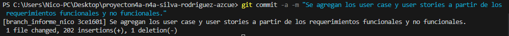
**Comando git status:**  
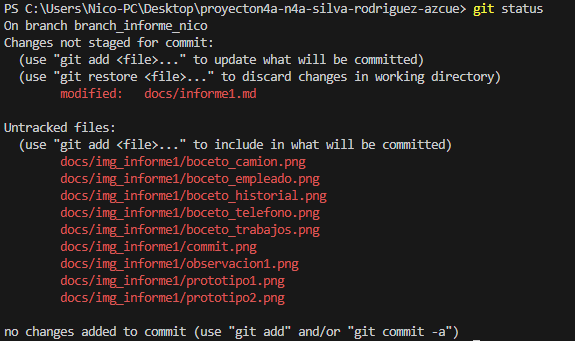
**Comando branch:**  
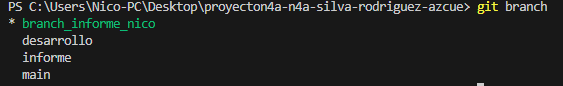

**Historial de commits:** 
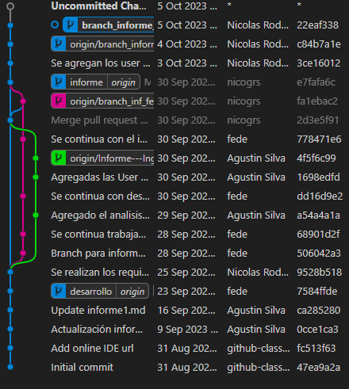

## Evolucion del proyecto: 

El proyecto enfrentó varios desafíos desde su inicio. Inicialmente, experimentamos un retraso de dos semanas debido a la decisión de dos clientes de abandonar el proyecto. Este retraso tuvo un impacto directo en los plazos de entrega previamente establecidos.

Además, aunque habíamos acordado tener reuniones semanales con el nuevo cliente, no pudimos mantener este ritmo, lo que resultó en dificultades para mantenernos alineados con las expectativas y necesidades en tiempo real.

En la etapa final del proyecto, surgieron varios cambios significativos en los requerimientos. Estos cambios fueron el resultado de un proceso de intercambio de ideas y bocetos que nos permitió identificar nuevos requisitos y ajustar algunos ya existentes. A raiz de esto, se produjeron modificaciones en el alcance del proyecto y la creación de nuevos requisitos.

Estos cambios inesperados generaron una desviación en el cronograma que habíamos planificado inicialmente para la realización de esta primera parte del proyecto. A pesar de estos desafíos, el equipo se adaptó con flexibilidad y trabajó de manera colaborativa para abordar los cambios y garantizar que el proyecto continuara avanzando de manera efectiva.

##  Versionado
Para las distintas versiones a tomar del software, tomaremos la siguiente referencia basada en que tan grande son los cambios en las versiones.

Los lineamientos serán los siguientes:
- **Cambios mayores (Versión Mayor)**: Es cuando al software se le agregan nuevas funcionalidades significativas o importantes, o cuando sufre grandes cambios.  Ej: *versión 4.0 a versión 5.0*
- **Cambios menores (Versión Menor)**: Es cuando en software se hacen arreglos o correcciones menores de errores, o cuando se agregan funcionalidades que no son tan vitales para el proyecto.  Ej: *versión 4.1 a versión 4.2*
- **Cambios pequeños (Revisión)**: se aplica una corrección al software, y a su vez sufre pocos cambios.  Ej: *versión 3.1.2 a versión 3.1.3*

## Elicitación

**Métodos de elicitación a utilizar:**
- Entrevista
- Ingeniería reversa
- Observación
- User personas

## Entrevista: **Tendremos una entrevista semanal con el cliente. Con este método podremos tener un primer acercamiento al cliente, entender cómo funciona su empresa y poder recabar información de lo que necesita resolver y/o desea mejorar u optimizar. Consideramos cuatro instancias de entrevistas esenciales.**

Las preguntas definidas para la primer entrevista son las siguientes:

- ¿Qué funcionalidad esencial espera que el sistema le permita hacer?
- ¿Cuáles son las distintas personas que van a actuar sobre el sistema?
- ¿Con qué frecuencia le gustaría tener entrevistas o reuniones?
- ¿Qué obstáculos/inconvenientes que recuerde presenta a la hora de hacer un trabajo?
- ¿Qué datos/información son relevantes para cada proyecto/trabajo?
- ¿Utiliza actualmente algún software o método para realizar los trabajos?
- ¿Qué requisitos de seguridad y privacidad deben considerarse?
- ¿En qué dispositivos le interesa que funcione el software?

La entrevista con el cliente se realizó por llamada. Tuvo una duración de dos horas aproximadamente, y se realizó de forma fluida y con un buen diálogo entre ambas partes. Durante la reunión, el cliente nos contó en detalles como funciona su negocio, cómo transcurre una jornada normal de trabajo, y con qué obstáculos se pueden enfrentar. Se hicieron todas las preguntas previamente planteadas, y el cliente además nos planteó sus preferencias con respecto al aspecto de la aplicación y con funcionalidades que debería contar la misma. 
Esta entrevista nos fue útil para poder entender claramente cómo funciona el negocio, cómo se desempeñan las tareas, cómo enfrentan las dificultades, y de esto poder tener una visión más clara de lo que el cliente necesita.  

Resumen de las respuestas a las preguntas planteadas:
- ¿Qué funcionalidad esencial espera que el sistema le permita hacer?
  - Lo principal que el cliente necesita es poder administrar y mantener un orden con los trabajos de fletes y repartos. Tener una vista sencilla y con la información necesaria de los trabajos que tiene por hacer a futuro, y mantener un registro o historial de los trabajos ya concretados. También necesita tener un sistema de observaciones a clientes de cada trabajo de flete, u observaciones del reparto. Por ejemplo, en caso de ser flete, se puede anotar una observación explicando cualquier inconveniente que implique un retraso, o en el caso de un reparto, que detalle los motivos de por que una mercadería fue rechazada.
- ¿Cuáles son las distintas personas que van a actuar sobre el sistema?
  - Las personas, o distintos tipos usuarios que actúan sobre el sistema, ya sea solo consultando datos o modificandolos, serán tres, los dueños, administradores y choferes. 
- ¿Con qué frecuencia le gustaría tener entrevistas o reuniones?
  - Al cliente le queda bien tener una reunión programada por semana o cada dos semanas.
- ¿Qué obstáculos/inconvenientes que recuerde presenta a la hora de hacer un trabajo?
  - Le gustaría tener un control e historial de motivos de rechazo de la mercadería. Ahora están anotando estos motivos en la propia boleta del reparto.
  - También se necesita saber que empleados tiene disponible en cualquier momento.
- ¿Qué datos/información son relevantes para cada proyecto/trabajo?
  - Los datos básicos para cada trabajo, por ejemplo un flete, son hora de comienzo, teléfono  y nombre del cliente, y el punto de destino. También tener un fácil acceso a un campo de texto editable para agregar una observación al cliente. 
  - En caso de reparto, le interesa tener los puntos de reparto, y ver los horarios de recepción de cada punto, para así poder organizar una ruta.
- ¿Utiliza actualmente algún software o método para realizar los trabajos?
  - Actualmente utilizan un sistema de boletas para mantener un control de los repartos y mudanzas.
- ¿Qué requisitos de seguridad y privacidad deben considerarse?
  - Los usuarios solo pueden ver la información y editar datos en el sistema, solo cuando su rol se los permite, 
- ¿En qué dispositivos le interesa que funcione el software?
  - Los empleados que están trabajando en el transporte, utilizarán el teléfono para hacer la operativa de la aplicación. Los usuarios administrativos y dueños (gerentes) podrán utilizar además la aplicación desde un equipo de escritorio. 

### Conclusiones de la primera entrevista:
- La aplicación será utilizada por distintos usuarios, cada uno con un rol particulares, siendo estos **Adminstrador**, **Conductor** y **chofer**. Cada uno de estos roles, tendrá una vista distinta de la aplicación, es decir podrá realizar distintas acciones y tendrán distintos permisos. Por ejemplo, un administrador podrá dar de alta a empleados, pero un chofer no podrá hacerlo.

- La empresa de fletes cuenta con dos tipos de clientes, **particulares** y **empresariales**:
 - Los clientes particulares son aquellos que necesitan un servicio común de flete, por ejemplo para una mudanza o el envío de encomiendas.  
 El costo del servicio de fletes común se cobra por hora.
 El cliente que va a contratar el flete puede elegir el chofer.
 - Los clientes empresariales, son aquellos que utilizan el servicio con más regularidad. En este caso la empresa de fletes le brinda el servicio de reparto de mercadería. En este caso, se tiene una hoja de ruta definida, es decir, las localidades donde se debe despachar cierta mercaderia.

- La flota de camiones es variada, a cada camión se le puede asignar una categoría, y el costo del servicio puede variar dependiendo de que camión se elija para el trabajo.  

- Como pantalla de inicio de la aplicación desde el punto de vista de un usuario con rol **chofer**, el cliente quiere que se muestren todos los clientes de los trabajos más próximos. Además, este usuario puede anotar una observación a cada cliente.  
En caso de que el trabajo sea un reparto, es posible que un cliente no quiera una mercadería por distintos motivos, por lo tanto es necesario que se pueda anotar este motivo y tener una noción de por qué se devolvió la mercadería.
Hasta el momento, el **chofer** estaba anotando y registrando todo esto en boletas. En estas boletas se detallan los productos que cada cliente va a recibir en el reparto.

- El usuario de rol **chofer** utiliza un teléfono para utilizar la aplicación, por lo que es requerimiento a cumplir que la aplicación sea totalmente funcional desde un dispositivo móvil.

Previamente a la reunión se prepararon dos prototipos de como creeiamos que podría llegar utiles para la primera entrevista. 

Los prototipos fueron los siguientes: 
**Prototipo 1:**
 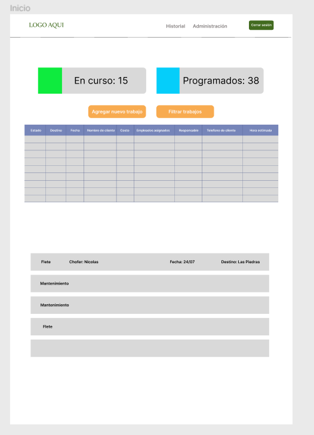

**Prototipo 2:**
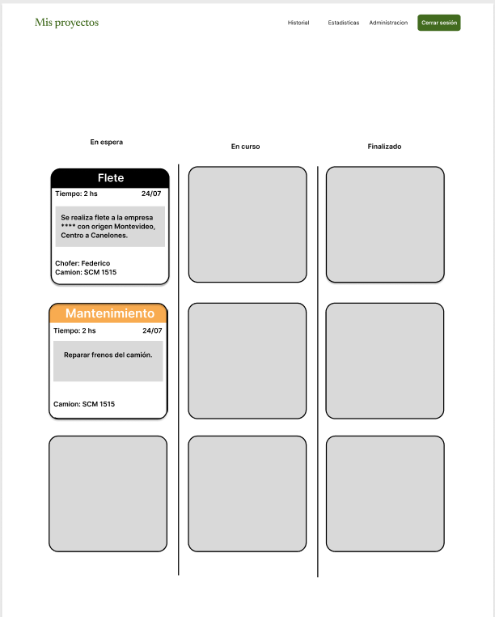

En este caso, el cliente se sintió más atraido por el prototipo 2.
Durante la misma entrevista, surgieron algunas ideas, como por ejemplo agregarle el costo de cada trabajo en cada tarjeta o que cada tarea quede diferenciada por un color.  
También cliente solicito que no se visualicen las tarjetas en el estado finalizado, ya que no le interesa saber los que tiene finalizados, sino si los que tiene pendientes o en curso.
 
Presentar los prototipos en esta primera entrevista, fue de mucha utilidad debido a que nos permitio abrir un intercambio de ideas con el cliente, donde logramos que se expresara más y entender lo que le parece relevante en la aplicación.

## Ingeniería reversa: 
**Analizaremos el comportamiento y funcionalidades de software existente que estén orientadas a resolver y administrar el mismo tipo de trabajo al que el cliente necesita.**

### Fleetio: Sistema de gestión de flotas

* Fleetio es un software de gestión de flotas basado en la nube que ayuda a las empresas a organizar, rastrear y
  mantener sus vehículos y activos.
* Este programa nos demuestra varias interfaces que nos pueden servir de inspiración para nuestro software.
* El software automatiza las tareas de mantenimiento, rastrea el uso de combustible,
  gestiona los registros de conductores y más.
  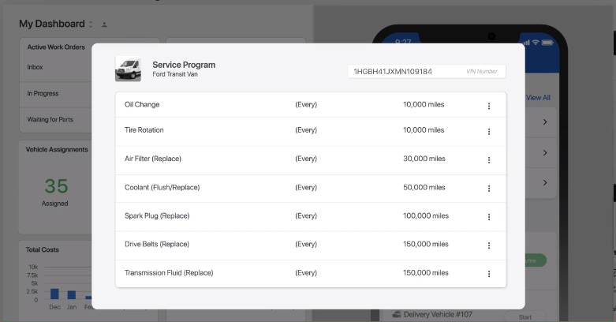
* Otorga las distintas interfaces dependiendo del usuario final, ya sea administrador, camionero, o dueño.
* Otorga métricas importantes que apuntan a la optimización de los recursos, como por ejemplo, el consumo de
  combustible, kilometraje, y el costo de mantenimiento de los vehículos.
  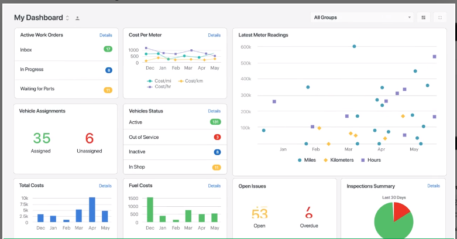
* Permite la asignación de fleteros a los distintos fletes, y la asignación de vehículos a los distintos fleteros.
  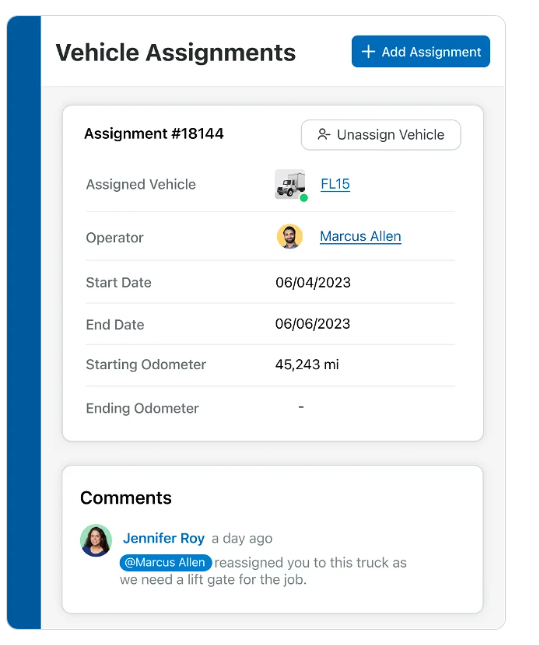
* Permite a los camioneros, ver los fletes asignados, poder subir incidentes que le pueden ocurrir al vehiculo, de
  forma de ser informado y asi, poder comenzar el proceso para arreglar dicho defecto.
  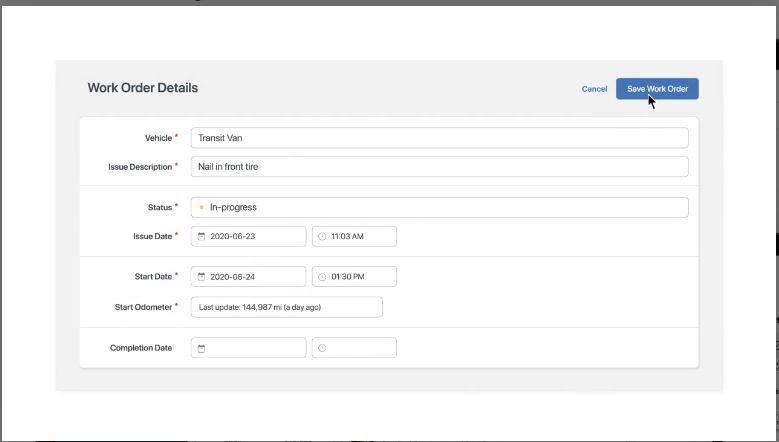
* Se asumen las distintas tablas en la base de datos que aportan los datos mostrados en la interfaz. Teniendo
  guardados usuarios, vehiculos, fletes, arreglos para los vehículos (tanto automáticos cada una cantidad específica de
  kilómetros recorridos o aquellos accidentales) y asignaciones de fletes a vehículos y usuarios.

## Observación  
Se observará cómo se desempeña el trabajo actualmente desde el punto de vista de los distintos roles 
dentro de la empresa. Esto con el fin de encontrar mejoras y poder adaptar las metodologías utilizadas al software que se implementará.

En este caso, decidimos visitar la empresa del cliente, para tener un contacto más cercano y poder entender el proceso en un entorno real.

En la parte gerencial, pudimos detectar que los problemas mas comunes son:
1. Coordinar las rutas de las entregas con los conductores.
2. Ubicación GPS en tiempo real del camión durante la entrega.
3. Gestionar los costos de operación, combustible y mantenimiento de los camiones.
4. Fecha y hora de inicio y finalización de la entrega.
5. Detalles de cualquier problema o retraso en la entreg

En la parte administrativa, pudimos obtener información relevante sobre los procesos claves en esa área.
Entre ellos son:  
1. Proceso de asignación de trabajo a los camioneros
2. Planificación de rutas en el caso de los repartos.
3. Registro de los datos de entregas.
4. Seguimiento en tiempo real de las entregas
5. Gestion de la flota y de los conductores.

En cuanto al proceso de asignacion de trabajo a los camioneros, la persona encargada de administración actualmente se maneja con hojas de calculo, llamadas o mensajes por Whatsapp. 

En cuanto a los conductores de camión los problemas más comunes que pudimos identificar son: 
1. Asegurar que las entregas se realicen de manera puntual y segura.
2. Registrar detalles de las entregas y cualquier problema que surja durante el viaje.
3. Tener una guia ordenada de la ruta a seguir de los clientes que deben repartir.
4. Lidiar con la documentación en papeleo físico.

En la siguiente imagén podemos pudimos obtener como como es la disposición del trabajo de los conductores.

Este metodo nos fue de gran utilidad para poder comprender mejor las necesidades especificas de cada área de la empresa.

## User personas

#### Administradora

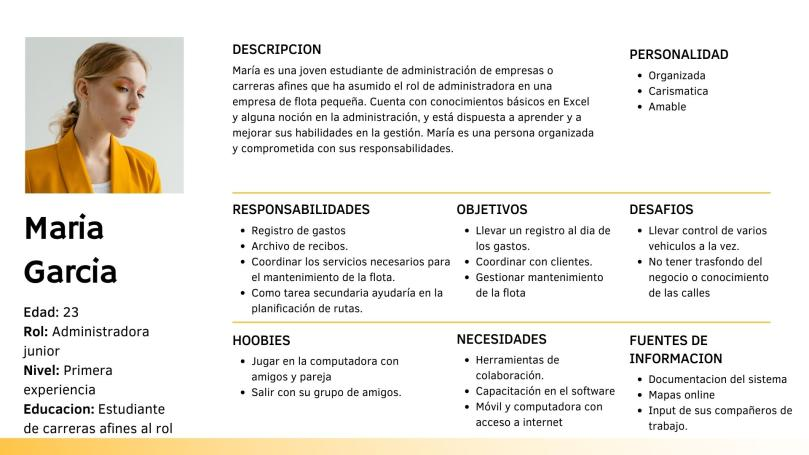

#### Conductor

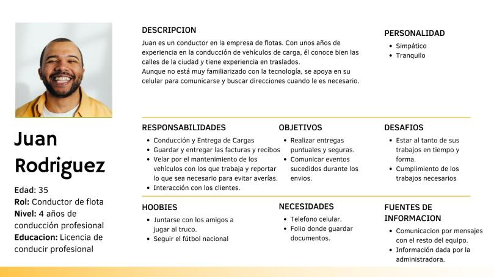

#### Gerente

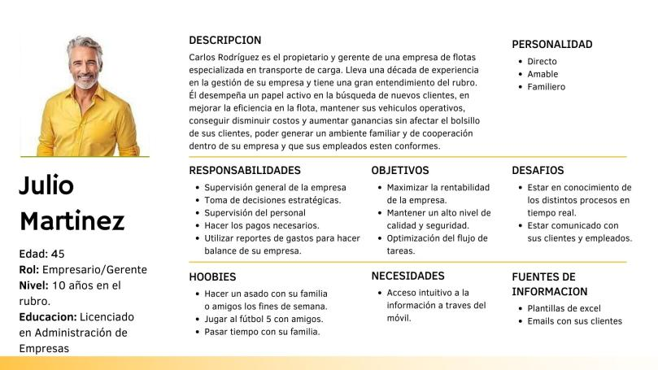

## Modelo conceptual

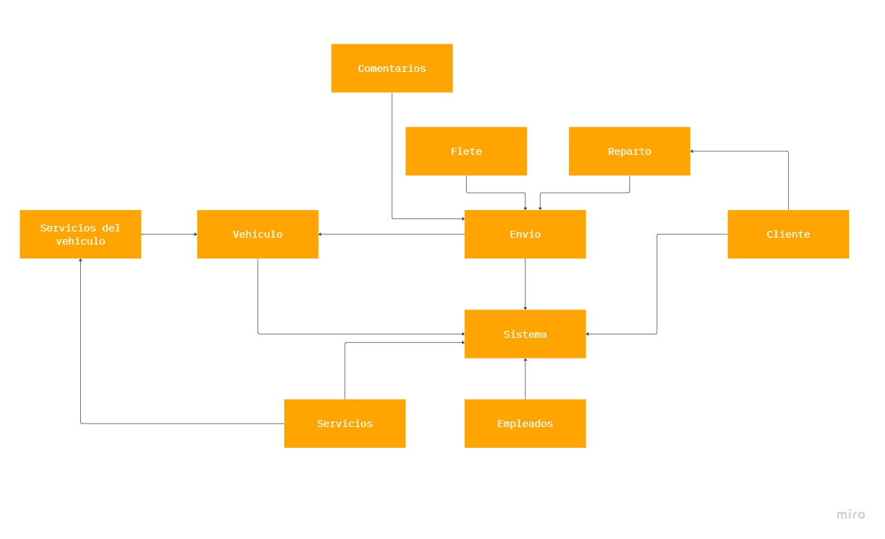

## Especificación

A partir de la información obtenida de las reuniones con el cliente, se plantean los requerimientos funcionales y no funcionales que nuestro sistema debe cumplir.
Acordamos en utilizar tres niveles de prioridad:
- **Prioridad 1 o Alta**, son las funcionalidades que si o si deben ser implementadas en las primeras etapas de desarrollo.
- **Prioridad 2 o Media**, son de alta prioridad, pero no son de nivel crítico.
- **Prioridad 3 o Baja**, son funcionalidades que se podrían o no implementar, ya sea para mejorar el producto visualmente o funcionalmente.

Otro elemento que también se repetirá mucho son los **estados**, estos están definidos en el requerimiento no funcional RNF#003.
Al decir únicamente administrador, peón o conductor, nos referimos a los usuarios que tienen uno de esos roles asignados.

## **Requerimientos Funcionales:**

**Id**: RF#001  
**Titulo**: Inicio de sesión de usuario 
**Descripción**: El usuario debe poder iniciar sesión con sus nombre de usuario o correo, y una contraseña de al menos 8 caracteres. 
**Prioridad**: Prioridad 1 - Alta  

**Id**: RF#002  
**Titulo**: Registro de empleados 
**Descripción**: Un administrador o gerente debe poder registrar a los empleados, con el nombre del nuevo empleado, email, apellido y su rol. Los valores de rol pueden ser: gerente, conductor, peón o administrador. 
**Prioridad**: Prioridad 1 - Alta  

**Id**: RF#003  
**Titulo**: Desactivación de usuarios 
**Descripción**: Un administrador puede desactivar a otro usuario. Un usuario que está desactivado, no puede realizar ninguna acción sobre el sistema ni puede ser asignado a nuevos trabajos. 
**Prioridad**: Prioridad 1 - Alta  

**Id**: RF#004  
**Titulo**: Alta de camiones  
**Descripción**: Un administrador puede registrar en el sistema un camión con su matrícula, marca del fabricante, y tamaño de la caja del camión, ya sea chico, mediano o grande.  
**Prioridad**: Prioridad 1 - Alta  

**Id**: RF#005  
**Titulo**: Desactivación de camiones 
**Descripción**: Un administrador debe tener la posibilidad de desactivar del sistema un camión. Un camión mientras está desactivado no puede ser asignado a nuevos trabajos. 
**Prioridad**: Prioridad 1 - Alta  

**Id**: RF#006  
**Titulo**: Registro de un trabajo de tipo flete 
**Descripción**: Un administrador puede registrar un trabajo de flete, especificando una fecha y hora estimada de comienzo, el lugar de partida y el lugar de destino, el nombre del cliente, el número de teléfono del cliente. Se considera como lugar de partida la dirección en donde se levantan los artículos ha ser llevados a un destino final.  
**Prioridad**: Prioridad 1 - Alta  

**Id**: RF#007  
**Titulo**: Registro de un trabajo de tipo reparto 
**Descripción**: Un administrador puede registrar un trabajo de reparto, especificando una fecha y hora estimada de comienzo, el lugar de partida y los distintos puntos de entrega. También debe asignar camión y un conductor o peón al nuevo trabajo de reparto. Se entiende por lugar de partida, el lugar donde el camión sale con la mercadería a bordo.  
**Prioridad**: Prioridad 1 - Alta  

**Id**: RF#008  
**Titulo**: Agregar nuevos puntos de destino en los trabajos de tipo **reparto**.  
**Descripción**: En los trabajos que son de tipo reparto, se debe tener la posibilidad de agregar nuevos destinos. Se puede agregar como destino inicial, como destino intermedio, o como destino final.   
**Prioridad**: Prioridad Alta - 1  

**Id**: RF#009  
**Titulo**: Quitar puntos de destino en los trabajos de tipo **reparto**.  
**Descripción**: En los trabajos que son de tipo reparto, se debe tener la posibilidad de quitar destinos. El destino a quitar puede estar en cualquier lugar de la hoja de ruta.  
**Prioridad**: Prioridad Alta - 1  

**Id**: RF#010  
**Titulo**: Modificar empleados asignados a un trabajo  
**Descripción**: Un administrador puede remover o asignar conductores y peones a los trabajos existentes en el sistema que no tengan como estado **_finalizado_** o **_cancelado_**.  
**Prioridad**: Prioridad 1 - Alta  

**Id**: RF#011  
**Titulo**: Asignar camión a un trabajo  
**Descripción**: Los administradores pueden asignar camiones a los trabajos creados que no tengan como estado **_finalizado_** o **_cancelado_**. 
**Prioridad**: Prioridad 1 - Alta

**Id**: RF#012  
**Titulo**: Selección de estado un trabajo  
**Descripción**: Un administrador debe poder cambiar el estado de los trabajos durante o luego de la creación de los mismos. Los estados disponibles para seleccionar son los especificados en RNF#003.  
**Prioridad**: Prioridad 1 - Alta  

**Id**: RF#013  
**Titulo**: Agregar comentario u observación a un trabajo de reparto o flete 
**Descripción**: Los usuarios que estuvieron asignados el trabajo deben tener la posibilidad de agregar comentarios o información extra, en formato de texto, a cada trabajo que se realice, ya sea antes, durante o luego de completado el trabajo. Es necesario que el trabajo ya esté registrado en el sistema. Además esta accion puede ser realizada por cualquier administrador.  
**Prioridad**: Prioridad 1 - Alta  

**Id**: RF#014  
**Titulo**: Consulta de histórico de trabajos  
**Descripción**: El usuario puede consultar los trabajos completados hasta la fecha. Se entiende por trabajo completado aquellos que tienen _realizado_ como estado asignado.  
**Prioridad**: Prioridad 1 - Alta  

**Id**: RF#015  
**Titulo**: Funcionalidad de búsqueda de trabajo.  
**Descripción**: Se tiene que poder buscar un trabajo en base a un id de trabajo, fecha de comienzo, nombre de cliente o número de teléfono de cliente.  
**Prioridad**: Prioridad 2 - Media.  

**Id**: RF#016  
**Titulo**: Estadística de trabajos  
**Descripción**: El sistema debe poder mostrar al usuario un informe con estadísticas que de cuenta de la cantidad de fletes o repartos realizados por conductor.  
**Prioridad**: Prioridad 3 - Baja  

**Id**: RF#017  
**Titulo**: Preferencias de orden  
**Descripción**: El usuario que esté consultando el historial (RF#0011), puede ordenar los trabajos de más antiguos a más recientes, es decir, mostrar los más antiguos primero, con respecto a su fecha y hora de comienzo.  
**Prioridad**: Prioridad 3 - Baja  

**Id**: RF#018  
**Titulo**: Agregar imágenes a un trabajo  
**Descripción**: Tener la posibilidad de adjuntar imágenes a un trabajo. El trabajo puede estar en cualquier estado, y la imagen no debe superar los 10mb  
**Prioridad**: Prioridad 3 - Baja  

**Id**: RF#019  
**Titulo**: Panel de administración en donde agregar el costo por hora de trabajo de flete  
**Descripción**: El administrador debe contar con un menú en donde agregar el costo de la hora de trabajo de tipo flete y el costo por hora de cada peón.  
**Prioridad**: Prioridad 1 - Alta  

**Id**: RF#020  
**Titulo**: Agregar nuevos puntos de destino en los trabajos de tipo reparto.  
**Descripción**: En los trabajos que son de tipo reparto, se debe tener la posibilidad de agregar nuevos destinos. Se puede agregar como destino inicial, como destino intermedio, o como destino final.   
**Prioridad**: Prioridad 1 - Alta  

**Id**: RF#021  
**Titulo**: Comienzo de trabajo por parte del conductor  
**Descripción**: Cuando un conductor va a comenzar con un trabajo, verá el siguente trabajo que tiene asignado ese debe dar inicio al trabajo y el sistema cambiara el estado del trabajo a **En Curso**.  
**Prioridad**: Prioridad 1 - Alta  

**Id**: RF#022  
**Titulo**: Servicios de mantenimiento para los vehiculos  
**Descripción**: Los servicios son creados con nombre de servicio, direccion del taller donde son realizados y costo del mantenimiento.  
**Prioridad**: Prioridad 1 - Alta  

### **Requerimientos No Funcionales:**

**Id**: RNF#001 
**Titulo**: Aplicación disponible en navegadores Firefox y Chrome 
**Descripción**: La aplicación tiene que poder ser utilizada en los navegadores Firefox versión _118_ y Chrome versión _117.0.5938.144_. Esto quiere decir que todas las funcionalidades de la aplicación tienen que funcionar correctamente en los navegadores mencionados.    
**Prioridad**: Prioridad 1 - Alta  

**Id**: RNF#002  
**Titulo**: Aplicación con interfaz responsive 
**Descripción**: La pantalla debe tener una interfaz que se adapte a distintos tamaños de pantalla, de manera que siga siendo utilizable en todas sus funcionalidades. Se debe tener en cuenta los estándares de resoluciones para pantallas de equipos móviles, como celulares y tablets, y pantallas de equipos de escritorio.  
**Prioridad**: Prioridad 1 - Alta  

**Id**: RNF#003  
**Titulo**: Estados disponibles para los trabajos  
**Descripción**: Los estados que están disponibles para indicar el estado de progreso de cada trabajo son:
	Planificado, En Curso, Realizado, Cancelado.  
**Prioridad**: Prioridad 1 - Alta  

**Id**: RNF#004 
**Titulo**: Restricción de funcionalidades dependiendo del usuario que esté en la sesión.  
**Descripción**: El usuario que este logueado en la sesión sólo puede realizar las acciones sobre el sistema que su rol asignado le permita. Por ejemplo un conductor no puede crear nuevos trabajos de ningun tipo.  
**Prioridad**: Prioridad 1 - Alta  

**Id**: RNF#005  
**Titulo**: Sistema de estados para los trabajos 
**Descripción**: Cada trabajo que esté en el sistema tendrá un estado asignado. Los estados posibles son **Planificado, En Curso, Realizado, Cancelado**. 
**Prioridad**: Prioridad 1 - Alta  

**Id**: RNF#006  
**Titulo**: Framework Bootstrap  
**Descripción**: El front-end de la aplicación se tiene que implementar con el framework Bootstrap version 5.3.2  
**Prioridad**: Prioridad 1 - Alta  

**Id**: RNF#007  
**Titulo**: Facilidad de uso  
**Descripción**: La aplicación debe tener una interfaz limpia, como los elementos necesarios para agregar información de un trabajo, ya sea creando uno nuevo o editando uno existente. Al usuario no se le deberia mostrar mas de tres páginas distintas por acción a realizar.  
**Prioridad**: Prioridad 2 - Media  

**Id**: RNF#008  
**Titulo**:	Identificación del tipo de trabajo por colores  
**Descripción**: En la vista donde se visualizan los trabajos, se tiene que poder diferenciar que tipo de trabajo es, reparto o flete, por medio de colores. El color #7F72AD se utiliza para los trabajos de reparto, y #F5BB5A para los trabajos de tipo flete.  
**Prioridad**: Prioridad 1 - Alta  

**Id**: RNF#009  
**Titulo**:	Orden por defecto de los trabajos  
**Descripción**: Por defecto, todos los trabajos se mostrarán en orden de más recientes primero con respecto a su fecha y hora de comienzo.  
**Prioridad**: Prioridad 1 - Alta  

**Id**: RNF#010  
**Titulo**:	No contemporaneidad de trabajos para un mismo empleado  
**Descripción**: Un empleado no puede estar asignado a dos o más trabajos que sean contemporáneos. Es decir, que sus intervalos de tiempo de solapen.  
**Prioridad**: Prioridad 1 - Alta  

**Id**: RNF#011  
**Titulo**: Registro de usuarios realizado solo por administradores  
**Descripción**: Una persona no se puede dar de alta o registrar en el sistema por su cuenta, siempre debe ser registrado por otro usuario con el rol administrador_.  
**Prioridad**: Prioridad 1 - Alta  

**Id**: RNF#012  
**Titulo**: Sincronización de datos  
**Descripción**: Los datos agregados o modificados por un usuario en el sistema, se tiene que ver reflejado en el sistema inmediatamente por todos los demás usuarios.  
**Prioridad**: Prioridad 1 - Alta  

**Id**: RNF#013  
**Titulo**: Solo acceso autorizado  
**Descripción**: Solamente las personas que estén autorizadas, y por lo tanto registradas en el sistema, podrán ingresar con los datos solicitados en RF#001, y realizar modificaciones y consultas al sistema.  
**Prioridad**: Prioridad 1 - Alta  

**Id**: RNF#014  
**Titulo**: Id de trabajo incremental  
**Descripción**: El Id, o número identificador de un trabajo, debe ser incremental. Es decir, con cada trabajo que se crea, el id se deberá incrementar en una unidad.  
**Prioridad**: Prioridad 1 - Alta  

**Id**: RNF#015  
**Titulo**: Estado de los vehiculos  
**Descripción**: Los vehiculos tienen distintos estados segun los procesos en los que esten involucrados y pueden limitar los procesos de los cuales pueden formar parte. Los estados pueden ser: Disponible, Ocupado, En mantenimiento, No disponible.  
**Prioridad**: Prioridad 1 - Alta  

## Casos de Uso

---
### ID: UC#001
### Inicio de sesión

#### Precondicion:
Usuario Registrado: El usuario debe estar registrado previamente.

#### Postcondicion:
Sesión Iniciada: El usuario tendrá acceso a los datos y funcionalidades segun el rol otorgado.
#### Actor

- Camionero
- Administrador
- Gerente

#### Curso normal:
| Accion del actor | Respuesta del sistema |
|:------------------:|:----------------:|
| 1. El usuario inicia sesion proporcionando sus credenciales, email y contraseña             | 2. El sistema verifica que las credenciales proporcionadas sean validas.         | 
|                | 3. Si las credenciales son validas, el sistema le da acceso a su cuenta según su rol.          | 
|                | 4. El sistema redirige al usuario a la pagina principal.         | 

#### Curso Alternativo
1. 1  El usuario ingresa las credenciales incorrectas: se emite mensaje 'Email o contraseña invalidas. Contacte con un administrador en caso de que siga ocurriendo.'

#### Requerimiento: RF#001

--- 

### ID: UC#002
### Registrar Empleado

#### Precondicion:
- Usuario Registrado: El usuario debe estar registrado previamente.
- Usuario con permisos: El usuario debe tener permisos para registrar un empleado.

#### Postcondicion:
- Sesión Iniciada: El usuario tendrá acceso a los datos y funcionalidades segun el rol otorgado.
- Empleado creado: El usuario podrá asignar un flete o trabajo.

#### Actor
- Administrador
- Gerente
#### Curso normal:
| Accion del actor | Respuesta del sistema |
|:------------------:|:----------------:|
| 1. El usuario selecciona 'Registrar empleado' | 2. El sistema muestra una ventana, con datos a rellenar del empleado.         | 
| 3. El usuario llena los datos, y confirma, apretando el botón 'Crear empleado'.               | 4. Si no hay datos sin rellenar, el sistema crea el nuevo empleado.          | 
|                | 4. El sistema redirige a la lista de empleados.       | 

#### Curso Alternativo
3. 1  El usuario dejo datos sin llenar: Se emite mensaje 'Faltan datos por completar.'

#### Requerimiento: RF#002

---
### ID: UC#003
### Alta de camiones

#### Precondicion:
- Usuario Registrado: El usuario debe estar registrado previamente.
- Usuario con permisos: El usuario debe tener permisos para registrar un camión.

#### Postcondicion:
- Camion creado: El usuario podrá asignar un flete o trabajo al camión creado.

#### Actor
- Administrador
- Gerente

#### Curso normal:
| Accion del actor | Respuesta del sistema |
|:------------------:|:----------------:|
| 1. El usuario selecciona 'Registrar camión' | 2. El sistema muestra una ventana, con datos a rellenar del camión.         | 
| 3. El usuario llena los datos, y confirma, apretando el botón 'Crear camión'.               | 4. Si no hay datos sin rellenar, el sistema crea el nuevo camión.          | 
|                | 4. El sistema redirige a la lista de camiones.       | 

#### Curso Alternativo
3.1  El usuario dejo datos sin llenar: Se emite mensaje 'Faltan datos por completar.'

3.2 El usuario intentó crear un camión que ya existe: Se emite mensaje 'El camión ya existe'

#### Requerimiento: RF#004

---

### ID: UC#004
### Registro de observaciones

#### Precondicion:
- Usuario Registrado: El usuario debe estar registrado previamente.
- Usuario con rol de camionero: El usuario debe tener rol de camionero para agregar observaciones
- Trabajo en proceso o finalizado: El camionero debe tener el trabajo que quiere agregar una observacion en proceso o finalizado

#### Postcondicion:
- Observación agregada en el trabajo: Una vez agregada la observación, no se puede editar.
- Agregar más de una observación: El camionero puede agregar más observaciones si lo desea.

#### Actor
- Administrador
- Gerente

#### Curso normal:
| Accion del actor | Respuesta del sistema |
|:------------------:|:----------------:|
| 1. El usuario selecciona 'Agregar observación' | 2. El sistema muestra un cuadro de texto..         | 
| 3. El camionero escribe las observaciones del trabajo que esta realizando y da clic en 'Agregar observación'.               | 4. Si el cuadro de texto no está vacio y tiene más de 5 caracteres se agrega la observación.          | 
|                | 4. El sistema agrega la observación al trabajo, y se visualiza en el momento      | 

#### Curso Alternativo
3.1  El usuario dejo el cuadro de texto vació y dio clic en agregar observación: Se emite un mensaje 'La observación no puede estar vacia.' 

3.2 El usuario da clic en agregar observación sin haber comenzado el trabajo antes: Se emite un mensaje 'El trabajo debe estar en proceso o finalizado para agregar observaciones'

#### Requerimiento: RF#013

---

## User Stories

---

#### ID: US#001
#### Titulo: Registo de trabajo flete.
Narrativa: Como administrativo, necesito poder registrar información sobre los trabajos realizados por nuestra empresa para mantener un registro de las entregas y su estado. 

#### Criterios de aceptación:
- El sistema debe poder permitir al administrativo ingresar el número y nombre del cliente, una fecha, el lugar de partida,lugar de finalización y tiempo estimado.
- El sistema debe permitir asignarle un estado al flete, siendo entre ellos: Planificado, En Curso, Realizado y Cancelado

#### Requerimiento: RF#006 y RF#012
---

#### ID: US#002
#### Titulo: Alta de camiones
Narrativa: Como gerente quiero tener una lista de camiones para poder controlar mi flota de una manera más acorde.

#### Criterios de aceptación:
- El sistema debe poder permitir al gerente agregar nuevos camiones
- El formulario de alta de camiones debe solicitar la siguiente información:
1. Marca del camión.
2. Modelo del camión.
3. Tamaño de la caja.
4. Matricula del camión
- Después de agregar un camión, el mismo se debe mostrar en la lista de camiones de manera automatica.
- El sistema debe validar que todos los datos esten completos antes de agregar el nuevo camión.
- El sistema debe mostrar un cartel cuándo se cree el nuevo camión, diciendo que se pudo crear el camión con éxito. 
#### Requerimiento: RF#004

---

#### ID: US#003
#### Titulo: Registro de empleados
Narrativa: Como gerente necesito poder registrar nuevos empleados para poder manejar el personal de mi empresa de manera efectiva.

#### Criterios de aceptación:
- El sistema debe poder permitir al gerente agregar nuevos empleados
- El formulario de alta de empleados debe solicitar la siguiente información:
1. Nombre y apellido del empleado.
2. Cedula.
3. Correo.
4. Rol
5. Sociedad
6. Domicilio
7. Telefono
- Los roles que pueden tener un empleado son: camionero, administrador y peón.
- El sistema debe validar que todos los datos esten completos antes de agregar el nuevo empleado
- El sistema debe mostrar un cartel cuándo se cree el nuevo empleado, diciendo que se pudo crear el empleado con éxito. 
#### Requerimiento: RF#002

---

#### ID: US#004
#### Titulo: Visualizacion de fletes para camionero
Narrativa: Como camionero necesito tener los fletes con los horarios de cada uno para organizarme con las entregas de una manera más organizada.

#### Criterios de aceptación:
- El sistema debe poder permitir al camionero visualizar los fletes o repartos asignados en su telefono celular de la empresa.
- Para cada instancia de trabajo, se debe poder visualizar el horario de entrega, la fecha, el tiempo estimado, y una breve descripcion.
- Los distintos tipos de trabajo se deben diferenciar con colores. Un flete debe tener un color y un reparto otro.
- Los trabajos tienen que estan ordenados segun el horario de entrega.

#### Requerimiento: RF#021, RNF#003, RNF#005, RNF#008, RNF#009

---

#### ID: US#005
#### Titulo: Observaciones en los trabajos.
Narrativa: Como administrativo, necesito que en cada trabajo tenga una seccion de observaciones, para poder controlar el motivo de las devoluciones de una manera más sencilla.

#### Criterios de aceptación:
- El sistema debe poder permitir al camionero agregar un texto como observación para cada trabajo.
- El administrativo debe poder visualizar estas observaciones para cada trabajo, sin tener que esperar a que el camionero vuelva a la empresa.

#### Requerimiento: RF#013

---

## Bocetos de IU

Luego de los primeros bocetos que fueron presentados en la primera entrevista y de haber completado el metodo de elicitación de observación, nos vimos aptos para poder realizar nuevos bocetos y luego poder validarlos con el cliente. 

Cabe aclarar que los bocetos tienen algunas modificaciónes que se realizaron durante la entrevista de validación y verificación con el cliente.

Para realizar los bocetos se utilizo la herramienta Adobe Photoshop.

**Area de tareas:**
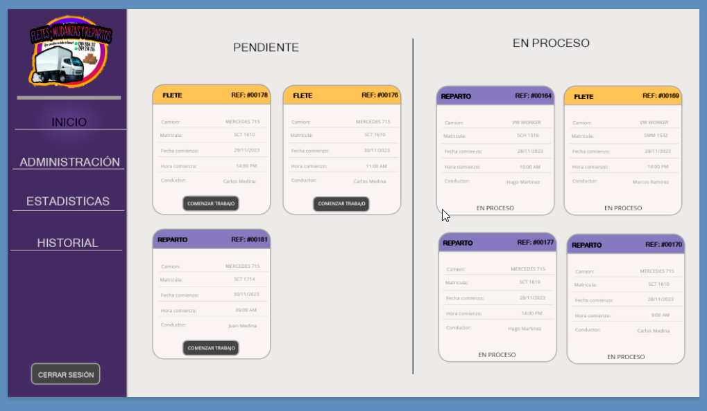

**Agregar camiones:**
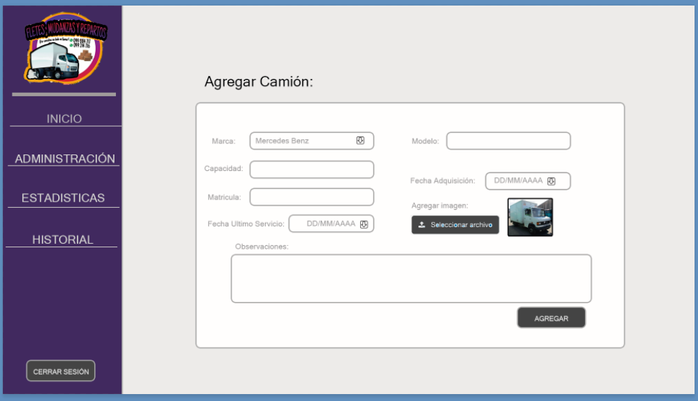

**Agregar empleados:**
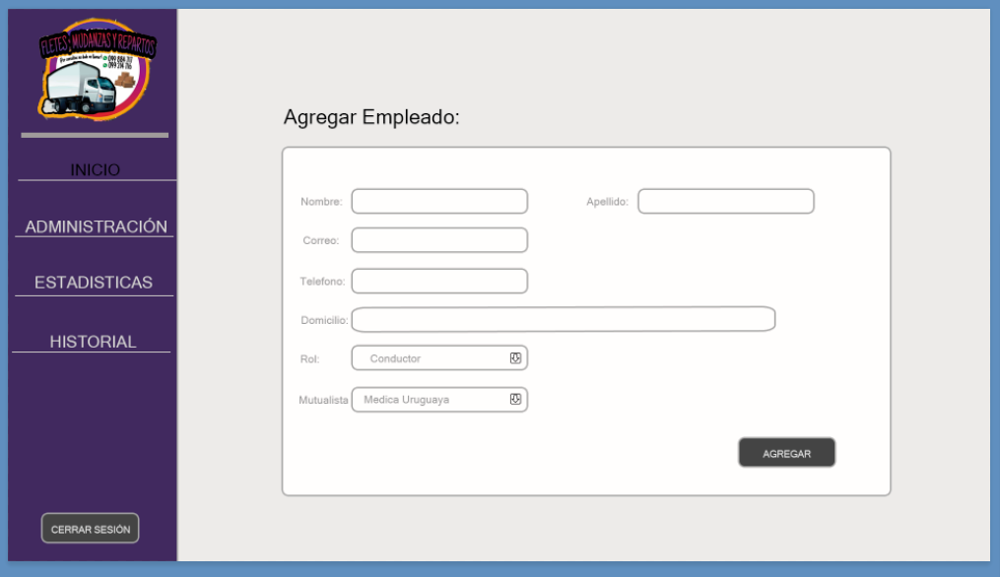

**Historial:**
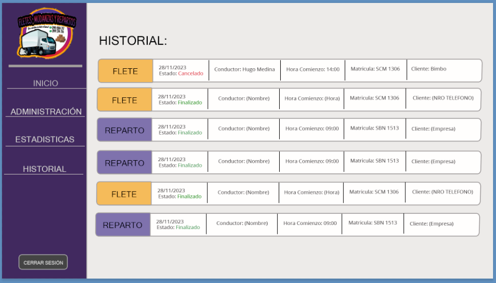

**Visualización en telefono:**

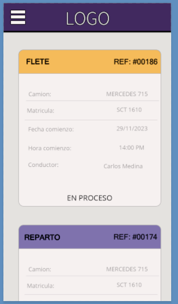

## Validación y verificación

**Objetivos de la verificación:**  
Verificación de que los requisitos sean claros y sin ambiguedades.

- Se validan los requisitos, ya que a partir de la creación de casos de uso y user stories, surgen nuevos requisitos que se deben crear para que la aplicación sea consistente.

- Se realiza un glosario, ya que notamos que pueden generar confusión algunas palabras, por ejemplo cuándo nos referimos a Trabajo, Flete o Reparto.

**Objetivos de la validación:**
- Se revisaran los requisitos con el cliente para confirmar su comprensión.

Se realiza una entrevista con el cliente, para poder validar los requisitos, casos de uso y user stories.

**Proceso de validación**: 
Durante la validación con el cliente, surgen algunas dudas de como seran las asignacion de tareas a los conductores.

Se plantea la duda de si un cliente puede aceptar más de un trabajo a la vez, y el cliente nos valida que un conductor no puede aceptar un nuevo trabajo sin haber terminado el anterior.

A partir de los bocetos, el cliente decide agregar más detalles tanto a los camiones como a los empleados.

En el caso de los camiones, el cliente solicita que se pueda agregar una imagen del camión al registrarlo.
Poder tener observaciones del camión, una fecha de adquirido, y una fecha de ultimo servicio.

Surge un nuevo Requerimiento No Funcional, el cual un camión no puede ser asignado en un mismo intervalo de tiempo, lo mismo pasaría con el conductor.

En general, los requisitos, casos de uso y user stories cumplen con las expectativas del cliente y no presentan ambiguedades. 

## Reflexión

### Conclusión general
El proceso de ingeniería que hemos seguido ha sido beneficioso y más que necesario para nuestro proyecto. Inicialmente, teníamos una idea en mente con distintos factores, pero a medida que avanzábamos y tuvimos las distintas reuniones con el cliente, pudimos adaptar y cambiar el enfoque al conocer mejor su negocio y sus necesidades específicas.

Durante estas reuniones, no solo recopilamos nuevos requisitos, sino que también verificamos y corroboramos los distintos niveles de prioridad, lo que nos llevó a agregar y modificar requisitos de manera constante. Esta iteración nos permitió tener una idea mucho más concreta y alinearnos más estrechamente en cuanto al producto final que estamos buscando crear.

La creación de las user personas también ha sido fundamental, ya que nos brindó una comprensión más profunda de a quién está dirigido el producto y cuáles son sus necesidades específicas. Esto nos ayudó a enfocar nuestros esfuerzos de desarrollo de manera más precisa y más enfocado al usuario y como el mismo interactúa con el mismo. Teniendo en cuenta las distintas interfaces a ser diseñadas más orientadas a la persona y menos a nuestra idea de que datos son necesarios.

Además, el ejercicio de ingeniería inversa de un sistema nos proporcionó una valiosa perspectiva sobre los campos necesarios para varios procesos, que luego fueron verificados para ajustarnos más a un sistema más personalizado y basado en las necesidades del cliente. Lo cual vimos que se puede perder al querer adaptar un sistema pensado en otro país a uno en nuestro territorio. Este ejercicio nos permitió diseñar y planificar nuestro sistema de manera más efectiva, asegurando que vamos a cubrir todas las bases necesarias.

En general, este proceso de refinamiento y adaptación continua nos ha puesto en una posición sólida para avanzar en el desarrollo de un producto que realmente satisfaga las necesidades y expectativas del cliente. Pensando el sistema más orientado a la persona que al sistema o al desarrollador.

### Aprendizaje
Durante este proceso, hemos llegado a comprender la importancia fundamental de utilizar métodos de elicitación en el desarrollo de software. La práctica de maquetar, crear instancias con el cliente para recibir sus aportes, presentar bocetos, hacer preguntas para conocer el negocio y las necesidades del mismo y recopilar sus opiniones ha demostrado ser esencial para profundizar en la comprensión del problema en cuestión y para obtener una visión clara de las necesidades del cliente.

En particular, destacamos la importancia de armar el boceto de la interfaz como tambien el modelo conceptual del sistema. Esta etapa nos ha proporcionado una base firme para la generación de ideas y nos ha permitido explorar diferentes enfoques de manera ágil y efectiva.
Lo que es igualmente relevante es que el costo de generar un boceto es considerablemente menor en comparación con los costos asociados con el desarrollo y la implementación de cambios en el código en sí. Esto no solo ahorra recursos, sino que también acelera el proceso de toma de decisiones y refina la dirección del proyecto.

Además, hemos aprendido que mantener un inventario de requisitos es esencial para el desarrollo futuro. Este registro no solo nos ayuda a mantener un seguimiento claro de lo que se necesita, sino que también nos permite dividir tareas de manera eficiente y priorizar lo que es esencial para el sistema, de forma de poder tener un sistema funcional que permitirá testear antes de finalizar el proceso de desarrollo. Esta estructuración facilita el trabajo en equipo y la gestión de proyectos a largo plazo, ya que brinda un marco de referencia sólido para las decisiones de diseño y desarrollo.

En resumen, el uso de métodos de elicitación, el bocetado y la gestión de requisitos han demostrado ser prácticas necesarias en nuestro proceso de desarrollo. Estas herramientas y enfoques no solo mejoran la comunicación con el cliente, sino que también optimizan nuestros procesos internos y nos dejan en posición firme para entregar soluciones efectivas y satisfactorias en el futuro.

#### Conclusión personal (Agustin):

En esta primera instancia del proyecto, empecé teniendo una idea, que a medida que se fueron dándose las distintas instancias tanto intergrupales como con el cliente. Fue transformado en algo que llega más cerca con las necesidades del cliente. Esta nos deja como enseñanza que cuanto más iteraciones se tenga donde se trabaje con el cliente y más se entienda al usuario final del producto, mejor va a ser nuestro producto final, para que sea cómodo de usar y no esté restringido en algún sentido.
Las distintas metodologías tienen su granito de arena y aportan a contribuir una idea más formada, siendo utilizar varias el mejor método para esto.

#### Conclusión personal (Nicolás):
Durante esta primera parte, me encontré trabajando tanto con el metodo de elicitación de entrevista como con el de observación.

Para la entrevista, con mis compañeros decidimos preparar una serie de preguntas, también optamos por preparar dos bocetos, para poder captar las preferencias del cliente y poder entender mejor su idea.

Pude entender que lo que uno estima puede variar, ya que se estimo con el cliente tener una entrevista semanal, lo cual no fue así. 
También al principio se nos cayeron dos clientes por lo que tuvimos que seguir en la busqueda.

Me gusto mucho hacer la parte de bocetos, ya que se puede llevar de una idea abstracta a algo más cercano a la realidad.

Realizar los User Stories también fuero de mucha ayuda, ya que me ayudo a pensar las limitaciones y necesidades que ibamos a tener a la hora de llevar acabo los requerimientos.

En conclusión, pude observar que el proceso de elicitación en el desarrollo de un software es fundamental, ya que definitivamente ayuda a reducir costos y tiempo.

(Federico)
De los cuatro métodos de elicitación aplicados, personalmente considero que los que nos sirvieron para visualizar el desarrollo de los requerimientos fueron la entrevista con el cliente, el método de ingeniería reversa, y observación. Con las entrevistas pudimos hablar bien con cliente, y él nos explicó con buen detalle cómo funcionaba cada parte de la empresa. Con esto y con las preguntas que teníamos planteadas, pudimos sacar bastante información. Además, ya habíamos investigado un par de aplicaciones similares a nuestro objetivo, y al presentarle al cliente como se veían estas aplicaciones pudimos sacar más información de lo que el cliente quería ver o no en pantalla.  
Lo que obtuvimos a partir de la observación, si bien ya nos fue muy útil al momento del desarrollo de los requerimientos, nos va a ser de mucha utilidad a la hora de implementar la vista del conductor, y como hacer su interfaz, más eficiente y útil.

También durante el desarrollo de las especificaciones, surgieron nuevas dudas, debates en el equipo y propuestas de requerimientos y bocetos de ui para el cliente.

## Glosario
- Usuario: Es una persona autorizada a realizar ciertas operaciones dentro del sistema. 

- Rol: Indica que tipo de actividades desarrolla dentro de la empresa, y también qué tipo de acciones puede realizar en el sistema.

- Administrador: Usuario con rol administrador

- Peón: Usuario con rol peón

- Conductor: Usuario con rol conductor.

- Trabajo: En este sistema, un trabajo se considera como una tarea, por lo general 

- Flete: Es un servicio de transporte contratado por una persona para llevar sus artículos personales (muebles, electrodomésticos, etc), desde un punto o lugar inicial un un punto final.

- Reparto: Es un tipo de trabajo. Este consiste en repartir mercadería de varios clientes en distintos puntos de entrega

- ID de trabajo: Número único que permite identificar a cada trabajo.

- Hoja de ruta: Secuencia de destinos que el conductor debe seguir durante el trabajo de tipo reparto.

## Referencias

- [Enlace a la web de Fleetio](https://www.fleetio.com/)
- [Versionado de software](https://es.wikipedia.org/wiki/Versionado_de_software)
- [Tipos de releases](https://www.parkersoftware.com/blog/the-three-software-release-types-and-what-they-mean-for-users/)
- [Practicas para el versionado de software](https://www.codium.ai/blog/best-practices-of-versioning-in-software-engineering/)
- [Mensajes de commit](https://www.freecodecamp.org/news/how-to-write-better-git-commit-messages/)
