# Informe entrega 2

## Construcción

Para la construcción de nuestro programa se hizo foco en 6 clases principales. 
- Clase camion
- Clase chofer
- Clase controladorTrabajo
- Clase flete
- Clase reparto
- Clase trabajo

donde las funciones más importantes las encontraremos en controladorTrabajo, dentro podremos encontrar funciones como: 

 - agregarTrabajo(): se encarga de obtener los datos del DOM, validar los datos con algunas funciones que fueron implementadas en el mismo archivo y luego utiliza las funciones 
  **agregarFlete()** y **agregarReparto()** para poder cumplir con los requerimientos RF#006, RF#007 y parcialmente el requerimiento RF#012.
 
 - actualizarTrabajo(): es la función que se encarga de actualizar los nuevos valores una vez que se edita un trabajo, esto nos permitira cumplir con el requerimiento RF#011 y RF#012, ya que podremos asignar un nuevo camión y editar el estado de un trabajo. 

También para la construcción de esta aplicación se utilizaron librerias externas como lo son:
 - Node
 - Nodemon. 
 - Jest. 
 - Express.
 - Bootstrap 

**Node:** 
Node.js es un entorno de ejecución de JavaScript del lado del servidor que permite ejecutar código JavaScript en el servidor. Además utiliza un sistema de módulos que permite organizar el código en archivos separados, facilitando la modularidad y la reutilización de código. También contiene npm que es un gestor de paquetes que facilita la instalación, gestión de paquetes de código.

**Nodemon:** Es un paquete que se utiliza para poder reiniciar el servidor automaticamente cada vez que se realiza un cambio, esto nos ayudó muchisimo ya que nos evito tener que estar parando el servidor y volver a levantarlo, sino que el mismo se reiniciaba luego de realizar un cambio. 
Para la instalación de Nodemon se utilizo el siguiente comando: npm install nodemon --save-dev dentro de nuestro proyecto.
Luego para que funcione, nos paramos en la carpet src de nuestro proyecto y utilizabamos el comando "npx nodemon app.js", el cual dejaba el servidor inicializado y con nodemon funcionando. 

**Jest:** Es la libreria solicitada para realizar las pruebas unitarias de nuestro proyecto. 
Para hacer uso de esta libreria tendremos ujna carpeta "tests" donde vamos a poder encontrar un archivo por cada clase del dominio. 
Comandos utilizados para jest
- "npm run test"
 

**Express:** Es un framework backend para Node, esta libreria nos fue de gran utilidad, ya que nos permitio poder trabajar directamente con javascript sobre HTML, por lo que nos facilito la carga de datos en la página, el manejo de rutas, solicitudes y respuestas.
Ejemplo: 
    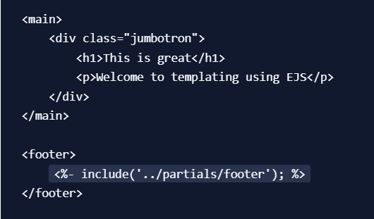
    
**Bootstrap:** Es un framework frontend que combina CSS y JavaScript el cual nos ayudo a dar una mejor visual a los elementos de nuestra página.
Además, bootstrap ofrece interactividad con la página, por lo que nos ayudo en cuanto a la comunicación entre el usuario con los menús de navegacion, al diseño responsive de la página como también crear modals y alertas de manera sencilla. 

### Estructura
---
En la carpeta src de nuestro proyecto, podremos encontrar la siguiente estructura de carpetas:
- models:  Dentro de esta carpeta encontraremos el dominio de nuestro proyecto con sus respectivas clases.
- public: En public encontraremos los archivos que podran ser vistos por el cliente en el navegador y no contiene información sensible.
- tests: En esta carpeta podremos encontrar todos los archivos 
- views: encontraremos los archivos ejs con contenido html dentro. Se separaron en diferentes archivos para poder reutilizar codigo.

### Servidor
---

Para poder ejecutar nuestra aplicación, sera necesario instalar las dependencias, para eso iremos a la carpeta src y ejecutaremos en nuestra terminal "npm install", finalmente podremos poner en servicio nuestra aplicación con "npm start app.js"

## Interfaz de usuario

La interfaz de usuario es el espacio donde ocurre la interacción entre el usuario y nuestra página web.

Es por esto que para nuestra interfaz, nos enfocamos en que sea sencillo a la hora de utilizar e intuitivo, que sea accesible tanto para una persona con experiencia al utilizar una computadora, como para una persona la cual no tenga experiencia.

Además nos enfocamos para que el diseño sea minimalista, de manera que sea "sencillo" pero atractivo visualmente. 

También era importante que nuestra página funcionara tanto para celular, como para computadora, asi que para lograr esto se utilizaron las siguientes herramientas:

 -  **HTML5:** Utlizado para estructurar la página y darle el orden deseado a nuestros componentes.
 - **BOOTSTRAP:** Se utilizaron los componentes como tablas, botones, cards y algunos atributos predefinidos para lograr que la página sea responsive. 
 - **JAVASCRIPT:** Utilizado para tener una respuesta luego de dar clicks en botones
 - **CSS:** Se utilizo para complementar con bootstrap. El mismo nos permitio dar algunos formatos especificos que deseabamos que no logramos con bootstrap.

#### COMPONENTES
---

A continuación se pasara detallar los componentes utilizados en nuestra interfaz de usuario.

 #### Inicio
 ---
 En esta sección podremos ver todos los trabajos creados y ver una breve información de cada uno.
 En esta parte no podremos encontrar mucha interacción con el usuario, sino que es meramente informativa.

 En está seccion se utilizo principalmente tarjetas de bootstrap para poder representar los trabajos.
 Aquí trabajamos con fila y columnas para poder diferenciar entre los trabajos planificados y los trabajos que estan en curso. 
 Cada tarjeta se va creando dinamicamente a partir de los trabajos creados y sus estados. 

Vista desde computadora:
 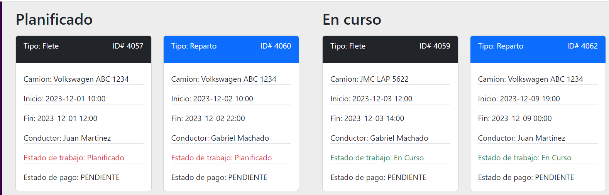
 Vista desde un movil: 

 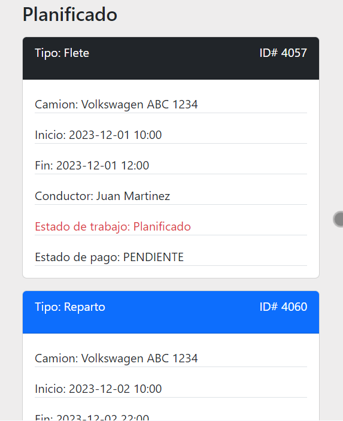

  #### Crear trabajo:
 --- 
Aquí se podra crear un nuevo trabajo, ya sea de tipo reparto, o de tipo flete:
Para poder seleccionar entre los distintos tipos de trabajos, decidimos utilizar un select
  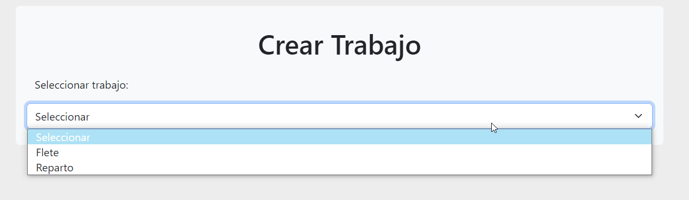
Con el select obtenemos el valor seleccionado, y mediante Javascript y Css damos visualización al formulario de flete o el de reparto segun corresponda. 
   
En los formularios utilizamos el atributo required para los inputs que consideramos necesarios que esten completados, por ende el navegador visualizara carteles segun el tipo de input que no este completo: 
    En el formulario podremos encontrar los siguientes inputs:
    Nombre cliente, Direccion Cliente, Direccion Destino, Descripción, el cual son de tipo **text**.

Fecha Inicio, Fecha Fin, los cuales son del tipo **date** y tienen asignado un minimo, que se obtiene la fecha actual del ordenador, y no deja crear una fecha posterior a la misma.

Hora Inicio, Hora Fin, son del tipo **time**.

También se utilizaron inputs de tipo button.
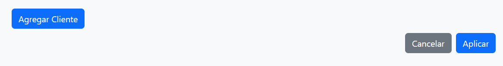

Vista desde computadora:
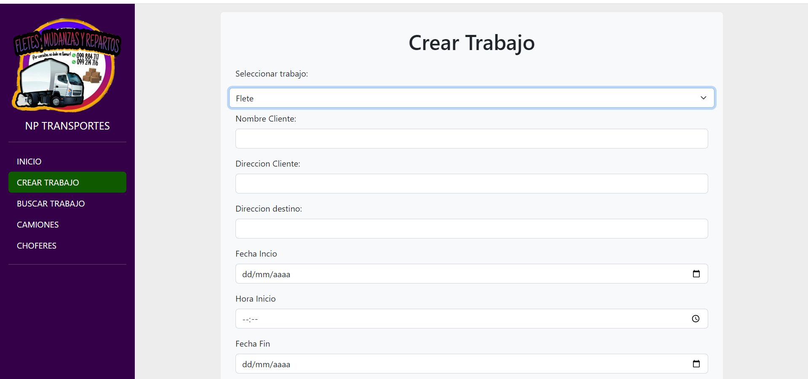
Vista desde movil:

  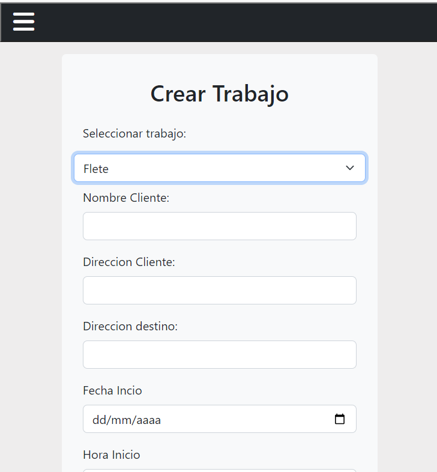
 

  #### Buscar trabajo:
  ---
En buscar trabajo nos encontraremos con una tabla, donde tenemos las columnas de: ID, Tipo,	Inicio,	Fin, Estado,	Direccion/es, Camión, Chofer, Detalles, Accion.
Las filas de esta tabla se crean dinamicamente, con todos los trabajos que hayan sido creados. 

Para buscar un trabajo, tenemos una buscador, el cual es un input de tipo text que nos va a filtrar los trabajo de la tabla, ya sea por id, fecha, estado, tipo, etc.
Este filtro lo va realizando en vivo, y no hay que darle un click de buscar o algo por el estilo.

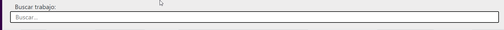

También tenemos un boton de "Detalles" el cual nos va abrir un modal de bootstrap con más información sobre el trabajo seleccionado.
Ejemplo:

 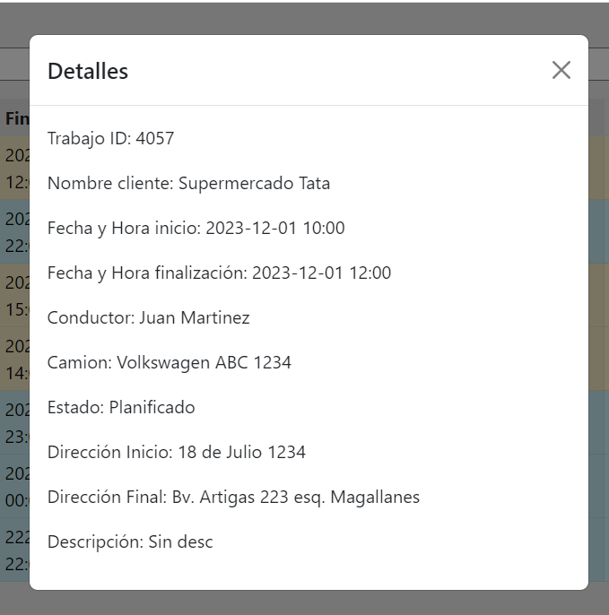

Vista desde computadora:
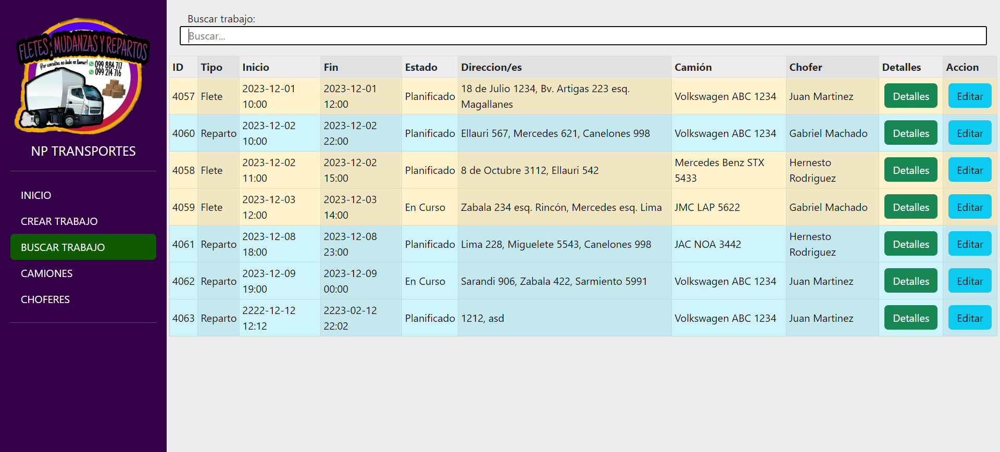
Vista desde movil:

  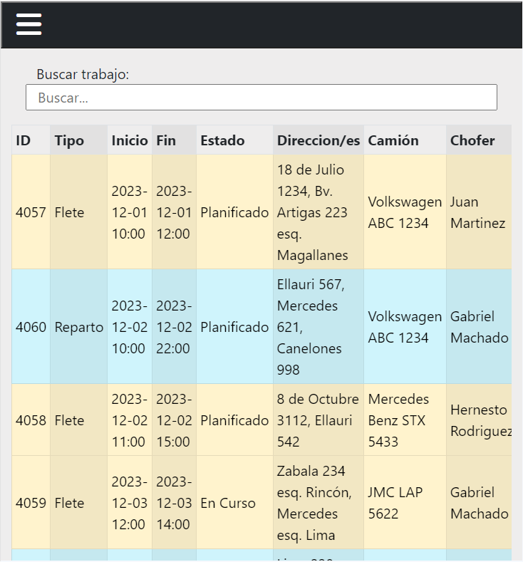

#### Editar un trabajo:

En la sección de buscar trabajo, para cada id de trabajo tendremos un botón de editar. 
Al darle click nos redireccionara a una página del siguiente estilo: 

Vista desde computadora:
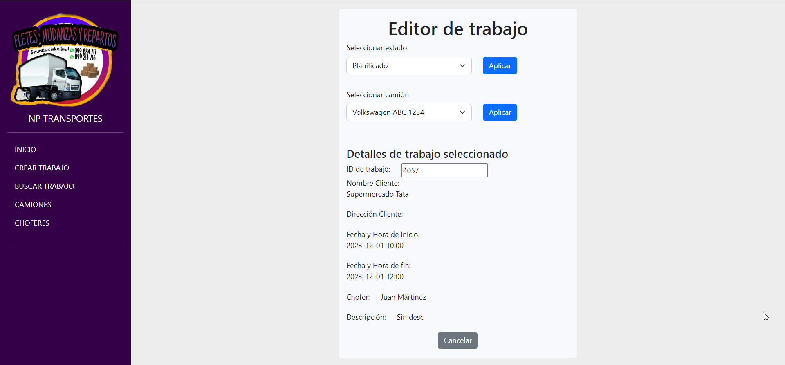

Vista desde celular:

 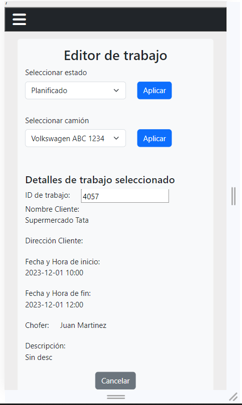

 En esta sección se cargaran parrafos con la id de los trabajos seleccionados, y un botón para aplicar el cambio de estado de un trabajo, y otro botón para cambiar la selección de un camión.

#### Sidebar o Navbar: 

Este componente nos va a permitir poder navegar de manera facil entre las distintas páginas y funcionalidades de nuestra aplicación.
En este caso el sidebar esta hecho con boostrap y algunas funciones de javascript para que cuando tengamos la página en tamaño de movil funcione como lo esperamos.
El sidebar se encontrara en todas las páginas, de manera fija de tal manera que nos podremos desplazar por toda la página y la sidebar se mantedrá en su lugar.

En el mismo vamos a encontrar 4 botones que nos van a permitir acceder a las distintas páginas.
 
 Vista desde web:

  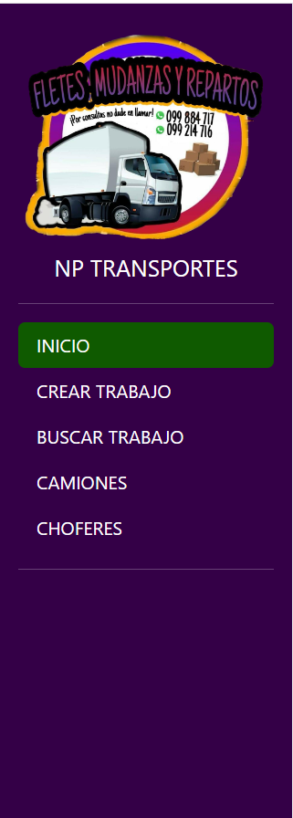

  Vista desde celular con navbar cerrado:

  

Vista desde celular con navbar abierto:

  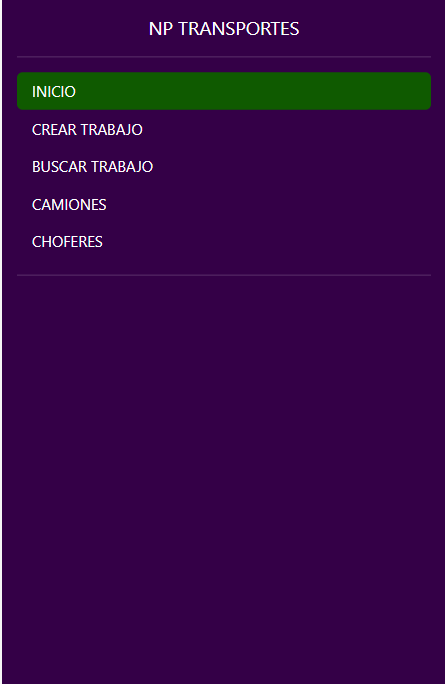
  

### Elementos Clave de Bootstrap
---
**Barra de Navegación (Navbar)**: Esta clase nos facilito la creación de nuestro sidebar.

**Formularios Estilizados (Forms)**: Clases como form-select, form-label proporcionan un diseño estilizado a los formularios.

**Botones Personalizados (Buttons)**: Las clases btn,btn-secondary brindan estilo a los botones, asegurando una apariencia uniforme y atractiva en toda la aplicación.

**Mensajes de Alerta (Alerts)**: Las clases alert se utilizan para mostrar mensajes de error, éxito o advertencia de manera clara y efectiva.

**Diseño de Tablas (Tables)**: Con las clases table y table-striped, se estilizan tablas para presentar de manera ordenada los trabajos de flete o reparto realizados.

**Contenedores Flexibles (Containers)**: Las clases container, container-fluid crean contenedores adaptándose al tamaño de la pantalla.

**Sistema de Cuadrícula (Grid )**: Clases como row, col-md-3, col-md-2 del sistema de cuadrícula, permiten crear diseños responsivos y adaptables a diferentes dispositivos.

  ---

### Buenas prácticas de implementación de frontend
---

Como buenas practicas, podremos notar que:
- Se separo el dominio de la interfaz.
- Se crearon varios archivos js, donde los scripts se ejecutan  páginas que son necesarias y asi evitar errores y sobrecargar la página con lo que no se va a utilizar. 
- Se trabajo con la herramienta ESLint para verificar errores en el código, y asi lograr consistencia. 
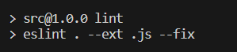
- Se realizó foco en que la página sea responsive.
- Accesibilidad: Se puede navegar en la página solo utilizando el teclado con el botón tabulador y enter.
- Separación de Concerns: Se separo el HTML, del Javascript y del CSS utilizando Express.

### Sistema de diseño
---
**Paleta de colores:**

Esta paleta de colores fue seleccionada por el cliente y fue variando a medida en que se fue desarrollando para poder lograr un buen contraste entre los colores.

Los colores en hexadecimal seleccionados son los siguientes:

Violeta: #340047  
Negro: #212529 
Celeste: #0d6efd 
Verde: #0f5a00 

**Tipografía:**
La tipografía seleccionada, fue la predeterminada de bootstrap que es  una font-family de tipo «Helvetica Neue», Helvetica, Arial, sans-serif.

**Espaciado:** El espacio utilizado se realizó con bootstrap, utilizando las clases predeterminadas que trae.
Las mismas se utilizarón segun lo fuimos considerando apropiado.
Se utilizaron las clases de bootstrap: p-3, p-2.
m-3, m.2

**Grid y diseño responsive:** Se utilizo 12 columnas para el diseño y asegurarse de que la interfaz sea receptiva para pantallas pequeñas y grandes.

La  misma fue dividida en 2 partes:
una 2 columnas para el sidebar, y las 10 columnas restantes para el contenido principal.

### Heuristicas de usabilidad
---
Heuristicas aplicadas:

**#1: Visibilidad del estado del sistema** : El diseño siempre debe mantener a los usuarios informados sobre lo que está sucediendo, a través de comentarios adecuados dentro de un período de tiempo razonable.

Consideramos que se aplico esta heuristica correctamente, nos basamos en mantener al usuario informado, brindando una total transparencia.

**Ejemplo:**

Al crear un trabajo, si el mismo fue creado con éxito:
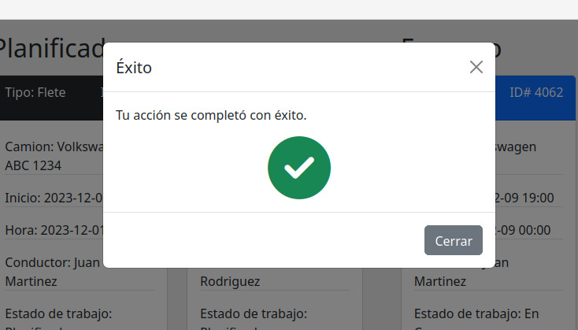

**#8: Diseño estético y minimalista**
Las interfaces no deben contener información que sea irrelevante o que rara vez se necesite. Cada unidad adicional de información en una interfaz compite con las unidades de información relevantes y disminuye su visibilidad relativa.

Consideramos que esta heurística fue aplicada correctamente, el feedback del cliente fue positivo en cuanto al diseño, el mismo no está sobrecargado de elementos que no se van a utilizar.

Tiene una paleta de colores atractiva

Visualmente es simple, por lo que ayuda a entender el flujo de la página de manera fácil e intuitiva 

**#5: Prevención de errores:**
Los buenos mensajes de error son importantes, pero los mejores diseños evitan cuidadosamente que ocurran problemas en primer lugar. Elimine las condiciones propensas a errores o verifíquelas y presente a los usuarios una opción de confirmación antes de comprometerse con la acción.

Consideramos que cumplimos esta heuristica parcialmente, ya que si bien mostramos mensajes de errores y de confirmación, en los formularios podríamos haber puesto un signo (*) a los campos que eran requeridos, y así el usuario evitar tener que darle a crear un formulario para que le vaya solicitando rellenar los campos.

Ejemplos:

Al querer crear un trabajo con un camión que ya tiene un trabajo asignado en ese horario, devuelve el siguiente error:
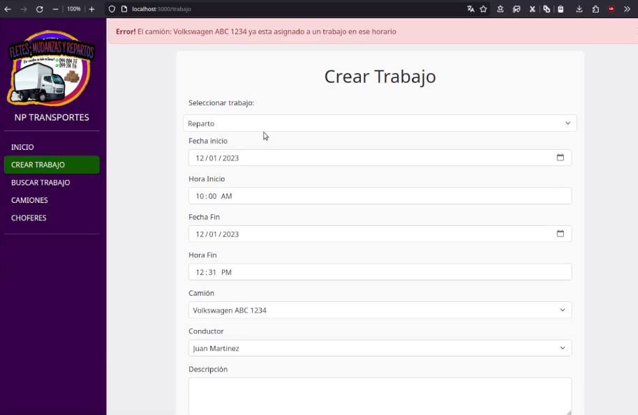

Al editar el estado de un trabajo, un camión o al crear un trabajo se solicita confirmación:
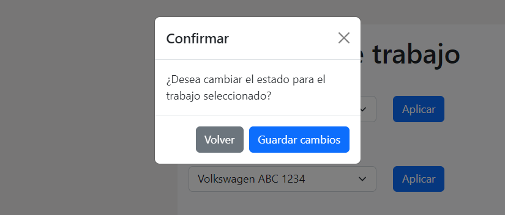

Ejemplo al querer enviar un campo vacio en el form:
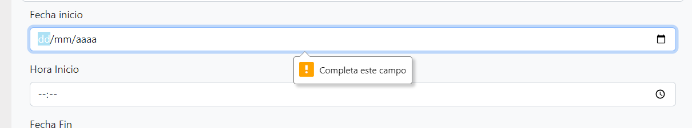

### Estándar de accesibilidad WCAG
---
Para poder cumplir con el estándar de accesibilidad, se utilizó la herramienta WAVE, el cual se instalo como una extensión en nuestros navegadores.

En esta etapa de comprobar la accesibilidad de nuestro sitio, comprobamos que tuvimos algunos problemas con los contrastes de colores, como también con algunas etiquetas, ya que al hacer copy paste de algunas secciones de nuestro HTML, quedarón etiquetas repetidas.
Luego también en los modales que quedan oculto en nuestro HTML y aparecen con Javascript, habían quedado sin etiquetas y no lograbamos encontrar lo que contenía problemas hasta que utilizamos una opción de WAVE que quita todos los estilos:
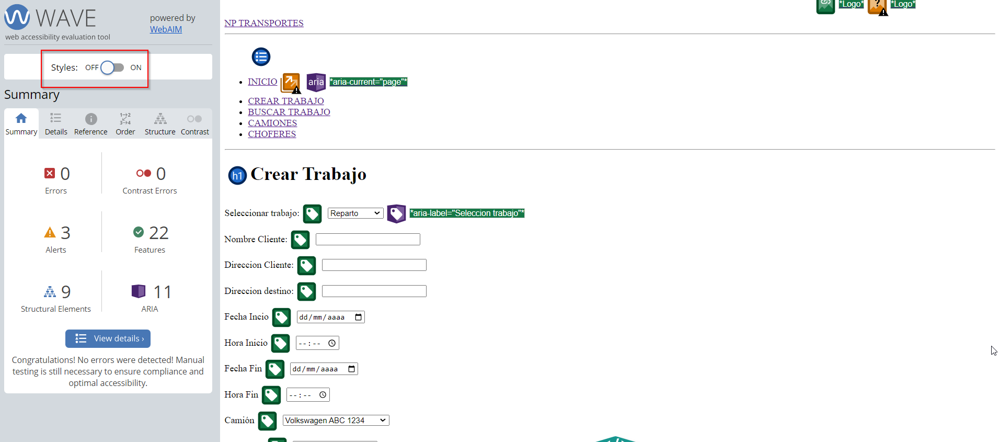

Esta herramienta fue muy util para encontrar de manera más eficente los errores de accesibilidad.

Finalmente, logramos quedar con 0 errores.
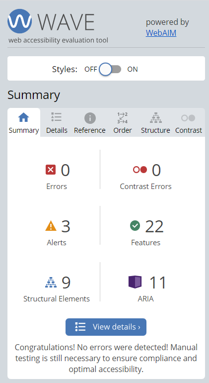
## Codificación

### IDE: Visual Studio Code: Configuración del equipo
Para la codificación fueron utilizadas varias herramientas y plugins, que permitieron mejorar la actividad de 
desarrollo. Ya que ninguno es conocedor de NodeJS, ESlint, Jest, que fueron herramientas necesarias para las 
distintas etapas del proyecto, los plugins disminuyeron la curva de aprendizaje, ya que permitieron detectar errores 
tempranamente y no esperar a compilar el proyecto para detectar errores.
#### Listado de plugins y herramientas utilizadas para el proyecto
- [ESlint](https://marketplace.visualstudio.com/items?itemName=dbaeumer.vscode-eslint)
    - Eslint fue utilizado para mantener un estándar de código en el proyecto, además de ayudar a detectar errores 
      de sintaxis en tiempo real.
- [ESlint-Config-Google](https://www.npmjs.com/package/eslint-config-google)
    - Este plugin fue utilizado para sumarse con ESlint para ayudar a detectar errores de sintaxis bajo el estándar 
      de Google.
- [NodeJS](https://nodejs.org/es/)
    - NodeJS fue utilizado para mejorar la experiencia de desarrollo, ya que permite resaltar la sintaxis propia del 
      lenguaje. Porque la idea es que el proyecto sea desarrollado para trabajar como un servidor, NodeJS permite 
      detectar errores de este mismo ámbito.
    - Además, NodeJS permite ejecutar el proyecto en un servidor local, lo que permite probar el proyecto sin la 
      necesidad de subirlo a un servidor externo.
- [Nodemon](https://www.npmjs.com/package/nodemon)
    - Nodemon fue utilizado para mejorar la experiencia de desarrollo, esta extension permite que al hacer cambios en 
      el código, el servidor se reinicie automáticamente, lo que permite probar los cambios sin la necesidad de 
      reiniciar el servidor manualmente.

### Estándares de codificación
Para la codificación del proyecto se utilizó el estándar de Google, ya que es un estándar bastante aceptado de una
de las empresas más grandes de tecnología. Además de ser la mayor proveedora de búsquedas en internet por lo que
prestar atención a los estándares propuestos por ellos nos puede permitir mejor posicionamiento en búsquedas.

**Los siguientes son algunos de los estándares seguidos:**
- Semántica de nombres de variables, clases, funciones, etc.
    - Las variables deben tener nombres descriptivos, que permitan entender qué es lo que se está guardando en ellas.
    - Las variables deben ser escritas en camelCase.
- Los tabs no fueron utilizados sino que se utilizó el espacio para indentar el código.
- Líneas largas de código fueron partidas para que no superen el límite establecido también por ESlint
- Se utilizaron líneas vacías para dividir el código con el fin de incrementar la fácil lectura, al estar dividiendo
  en distintos bloques de código que contienen partes de lógicas distintas.
- CSS, quedó alojado en otro archivo diferente de HTML, para mejorar la legibilidad del código. Esto quedó logrado
  más que nada debido a utilizar Bootstrap.
- Se dividió bastante las carpetas para diferenciar las clases que pertenecen al dominio, las clases que pertenecen
  a la interfaz de usuario, los tests, etc.
- Se utilizó bastante la herencia para utilizar el método DRY.
- Las variables creadas fueron creadas al ser utilizadas y no quedaron claras todas juntas.

### Buenas prácticas de OOP
En el proyecto utilizamos practicas de programación orientada a objetos (OOP), con el fin del que el código sea mantenible, entendible y se puede escalar a nuevas funcionalidades.  
Nuestro proyecto cuenta con una capa de interfaz o vista del cliente (<b>views, public</b>), y una capa de dominio (<b>models</b>).
El módulo <i>app.js</i> es el encargado de levantar el servidor local, y de la comunicación entre la interfaz y el dominio.  
Con respecto al <b>dominio</b>, nos basamos en el modelo presentado en el informe 1.
Este consta de seis clases, <b>Trabajo</b>, <b>Flete</b>, <b>Reparto</b>, <b>Chofer</b>, <b>Camion</b> y <b>enumerados</b>, siendo Reparto y Flete clases hijas de Trabajo.
Además tenemos los módulos <b>controladorTrabajo</b> y <b>requestParser</b>, <b>utils</b>.
 

A continuación se explican brevemente las funciones, métodos, clases y módulos de nuestro proyecto.
* <b>Trabajo:</b> Esta clase es para representar la estructura básica de un trabajo. También nos proporciona dos métodos para poder modificar el estado del trabajo y el estado del pago.

  * Atributos:
    * id
    * fechaInicio
    * horaInicio
    * fechaFin
    * horaFin
    * tipoTrabajo
    * camion (id del camión asignado)
    * conductor (id del conductor)
    * estadoTrabajo
    * estadoPago
    * descripcion

  * Métodos:
    * trabajo(...): Constructor de la clase Trabajo.
    * setCamion(camion): Modifica el camión asignado al trabajo.
    * setEstadoTrabajo(estado): Cambie el estado de pago.

* <b>Flete:</b> Esta es una clase derivada de Trabajo. Agrega atributos específicos para el trabajo de tipo Flete. 

    * Atributos:
      * direccionIni
      * direccionFin
      * nombre (nombre del cliente)

    * Métodos:
      * flete(...): Constructor de la clase Flete.
      * direccionToString: Devuelve un string que contiene la dirección de inicio y fin.

* <b>Reparto:</b> Al igual que Flete, Reparto es una clase hija de Trabajo, también agregando su atributo especifico.

    * Atributos:
      * direcciones (arreglo de direcciones)

    * Métodos:
      * Reparto(...): Constructor de clase Reparto.
      * direccionToString(): Devuelve un string con todos las direcciones concatenadas.

* <b>Chofer:</b> Estructura de la información de chofer/conductor.

    * Atributos:
      * id
      * nombre
      * edad
      * sociedad
      * teléfono

    * Métodos:
      * chofer(...): Constructor de la clase chofer.
      * toString(): retorno el nombre del chofer

* <b>Camion:</b> Contiene la estructura básica de un camión.  
    Aquí, el atributo matrícula contiene la marca y modelo del camion. Ej, "Mercedes Benz 979".

    * Atributos:
      * id
      * modelo
      * matricula
      * fecha

    * Métodos:
      * camion(...): Constructor de la clase Camion.
      * toString(): retorna un string del tipo "modelo matricula".

* <b>Enumerados:</b> Contiene dos enumerados, <i>estadoTrabajo</i>, y <i>estadoPago</i>, lo cuales son utilizados para definir el progreso y estado de pago de un trabajo respectivamente. De esta manera, podemos restringir el dominio de valores posibles para estos atributos. En caso de necesitar agregar un nuevo valor posible a alguno de estos atributos, solamente es necesario agregarlo al enumerado correspondiente.

    * estadoTrabajo: 
      * PLANIFICADO: 'Planificado'
      * EN_CURSO: 'En Curso'
      * REALIZADO: 'Realizado'
      * CANCELADO: 'Cancelado'

    * estadoPago:
      * PENDIENTE: 'PENDIENTE'
      * PAGADO: 'PAGADO'

* <b>controladorTrabajo:</b>
  * Dentro del dominio, este módulo se encarga de interactuar y crear nuevas instancias de la clase Trabajo. De esta forma, se evita que la capa de interfaz tenga visibilidad a las mismas. Ademas, controladorTrabajo es la que se encarga de cambiar el estado de los trabajos a traves de los métodos de la clase Trabajo.

    * Funciones:
      * <b>cargarDatosPorDefecto</b>: Esta función se utiliza para cargar la aplicación con datos. Se invoca en iniciador.js. También es utilizada en cargadorTrabajos.test.js.

      * <b>agregarTrabajo</b>: Recibe un objeto con los datos para crear un trabajo, dependiendo del atributo "tipo" el trabajo que se crea. Notar que hasta momento aun no se han hecho validaciones de si el trabajo se puede crear o no.

      * <b>buscarElemEnArrayID</b>: Recibe un ID y un arreglo, y busca en el arreglo el objeto por id.

      * <b>buscarTrabajoID</b>: Recibe un ID, y Utiliza buscarElemEnArrayID pasando el arreglo <i>arrTrabajos</i>.

      * <b>buscarCamionID</b>: Recibe un ID, y Utiliza buscarElemEnArrayID pasando el arreglo <i>arrCamiones</i>.

      * <b>buscarChoferID</b>: Recibe un ID, y Utiliza buscarElemEnArrayID pasando el arreglo <i>arrChoferes</i>.

      * <b>getContadorNext</b>: Incrementa el contador de ID, y luego lo retorna.
      
      * <b>agregarFlete</b>: Recibe los siguientes datos para intentar crear una instancia de Flete:
          * <i>id</i>, <i>fecha de inicio</i>, <i>hora de inicio</i>, <i>fecha de fin</i>, <i>hora de fin</i>, <i>camión</i>, <i>conductor</i>, <i>dirección de inicio</i>, <i>dirección de final</i>, <i>nombre de cliente</i>, <i>descripción</i>.  

        &emsp; Antes de intentar crear la instancia y agregarlo al arreglo global de trabajos, hace la validación de los datos que recibe. Estos métodos de validación se definen mas adelante.

      * <b>agregarReparto</b>: Recibe los siguientes datos para intentar crear una instancia de Reparto:
          * <i>id</i>, <i>fecha de inicio</i>, <i>hora de inicio</i>, <i>fecha de fin</i>, <i>hora de fin</i>, <i>camión</i>, <i>conductor</i>, <i>arreglo de direcciones</i>, <i>descripción</i>.  

        &emsp; Antes de intentar crear la instancia y agregarlo al arreglo global de trabajos, hace la validación de los datos que recibe. Estos métodos de validación se definen mas adelante.

      * <b>validarId</b>: Recibe un Id y busca si hay un trabajo con ese Id. Se encuentra, devuelve un error con el mensaje 'El trabajo con id ya existe'.
      
      * <b>validarFechaInicioMenor</b>: Recibe fecha de inicio, hora de inicio, fecha de final. hora de final y devuelve error si la fecha y hora de inicio es posterior a la fecha y hora de final.
      
      * <b>validarCamion</b>: Valida que el camión no este ocupado en el rango de fechas recibido por parámetro. En caso de que se encuentre un camión que este ocupado en ese intervalo de tiempo, se retorna un error.
      
      * <b>validarConductor</b>: Valida que el conductor no este ocupado en el rango de fechas recibido por parámetro. En caso de que se encuentre un conductor que este ocupado en ese intervalo de tiempo, se retorna un error.
      
      * <b>validarInclusionFechas</b>: Valida que que no haya solapamiento entre dos fechas dadas. En caso de haber solapamiento, retorna true.
      
      * <b>ordenarArregloTrabajo</b>: Ordena el arreglo de trabajos <i>arrTrabajos</i> por orden de fecha y hora de comienzo.
      
      * <b>filtrarTrabajosPorEstado</b>: Recibe un estado por parámetro y retorna un arreglo con los trabajos que tengan ese estado como estadoTrabajo.
    
      * <b>actualizarTrabajo</b>: Recibe un id de trabajo, un campo que indica que atributo del trabajo se va a modificar, y el nuevo valor que se le va a asignar. En caso de que se intente modificar el camión, y el trabajo este con estado <i>Cancelado</i> o <i>Realizado</i>, se retorna un error. En esta función también se llama al validador de camión, para verificar que no se este agregando un camión que ya esta en uso en ese intervalo de tiempo. asdf 
      
      * <b>getListaTrabajosCompleta</b>: Esta función retorna un arreglo de trabajos, pero con los atributos , conductor, chofer y direccion, con string formateados para ser mostrados en pantalla. En caso de ser un trabajo de tipo Reparto, se agrega un arreglo de strings con las direcciones.

* <b>requestParser</b>: El objetivo de este modulo es convertir los req.body en objetos, para asi luego pasárselos como parámetros a las funciones de los controladores (ej, controladorTrabajo).
  * Función:
    * parseReqCrearTrabajo(): Recibe un req, y crea y retorna un objeto con los datos que tiene req.body.

### Análisis estático de código

En el proyecto se aplicaron estándares de codificación, teniendo como base el estilo de código planteado por Google. A medida que se trabaja en cada archivo del proyecto, con la extension de Eslint para Visual Studio Code, se resaltaba como un error cuando no se estaba respetando el estilo de codificación. 

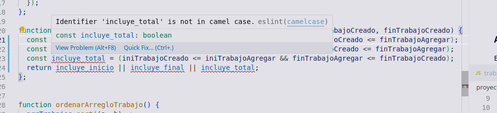 

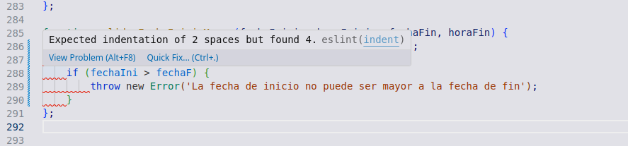 

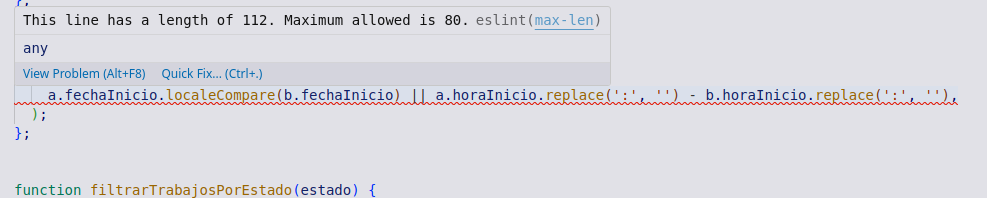  
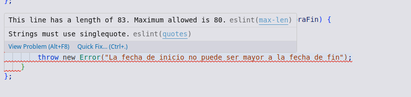  

La librería Eslint de node, permite ejecutar el siguiente comando 'npx eslint .', donde nos muestra en la consola todos los errores de codificación que tenemos en nuestros archivos. Agregando "--fix" al final del comando anterior, este nos intenta solucionar los errores. Los errores que notamos que no logro solucionar automáticamente en nuestro proyecto eran los errores <i>max-len</i> y <i>camelCase</i>. Estos errores son fáciles de solucionar. Los errores de camelCase hay que simplemente buscar todas las ocurrencias de esa variable y reemplazarlo con el nuevo nombre en camel case. En el caso de max-length, también es fácil de solucionar, pero puede que el código quede menos legible si se salta a nueva nueva linea. Por lo que en este caso se puede ignorar el error para esa linea agregando el comentario <i>"// eslint-disable-next-line max-len"</i> en la linea anterior. También se puede agregar el comentario <i>"/* eslint-disable max-len */"</i> al comienzo del archivo para ignorar este error en el documento.  

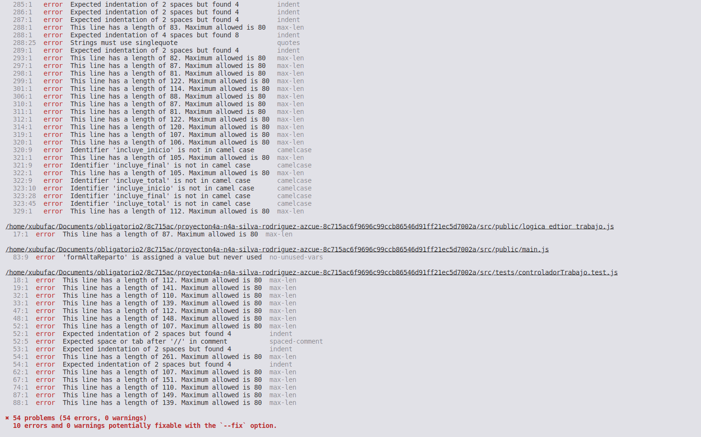  
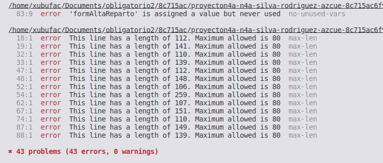  

Una vez resuelto este tipo de errores, volviendo a ejecutar <i>npx eslint .</i>, podemos ver que no se muestra nada en consola, diciendo que no se encuentran mas errores de estilo de codificación.

Para facilitar la ejecución de eslint, se agrega la siguiente linea en package.json:
  * "lint": "eslint . --ext .js --fix"

## Test unitario
Utilizamos JEST, que es un framework de javascript, para el testeo unitario de nuestra aplicación. Este testeo consiste en crear un archivo de test para cada archivo de nuestro dominio, los cuales se podrán encontrar en <i>src/tests/</i>. Es decir, para cada archivo que mencionamos en la etapa de Buenas Practicas de OOP, tendremos un archivo con extension <i>".test.js"</i>, por ejemplo <i>controladorTrabajo.test.js</i> 
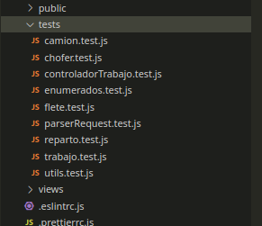 
Para que los test estén bien organizados, estructurados y sean entendibles, se utiliza <i>describe()</i> para agrupar test que están relacionados, y luego <i>test()</i> para especificar lo que se esta queriendo testear en ese caso.
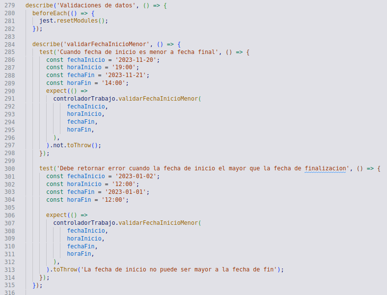  
En cada test, se llama a la función a probar, y con el matcher apropiado, se compara el resultado obtenido con el resultado esperado.  
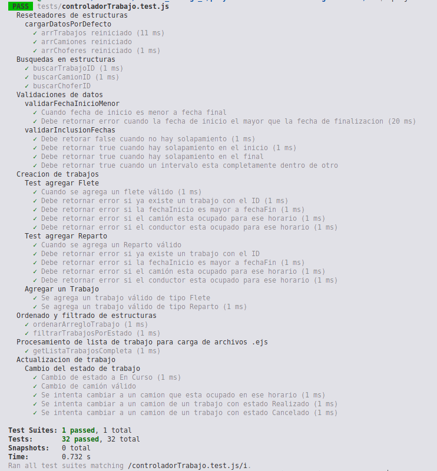  
En caso de que algún test falle, se muestra de la siguiente manera: 
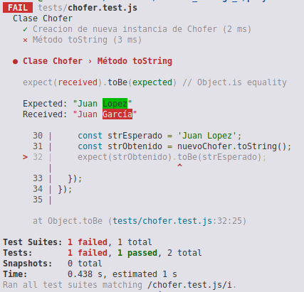  

Otro punto importante de este test es la cobertura total de código. Para esto agregamos <i>"--coverage"</i> al momento de ejecutar jest. Con esto lo que se busca es que todas las instrucciones y caminos posibles que existan en las distintas funciones y métodos de nuestro código. Para esto, lo ideal es obtener un 100% de cobertura de código con los tests. En nuestro caso, logramos obtener el siguiente resultado: 
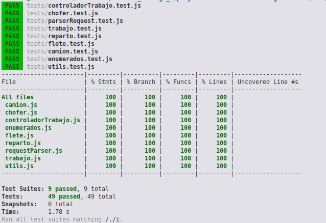 

Para facilitar la ejecución de este comando, se agrega la siguiente linea en package.json:
  * "test": "node --experimental-vm-modules node_modules/jest/bin/jest.js --coverage"  

Y luego se puede correr en la consola "npm run test".

## Reflexión

### Detalle del trabajo individual:

#### Reflexión personal (Nicolás):

Al llegar al cierre de este proyecto, siento una gran satisfacción por los logros alcanzados y el trabajo colaborativo realizado con mis compañeros. La experiencia ha sido enriquecedora, proporcionándome una comprensión más profunda de todo el proceso involucrado en el desarrollo de un producto de software.

Considero que el equipo ha logrado un trabajo sólido que va más allá de cumplir con los requisitos iniciales. Con el equipo se llego a considerar posibilidad de seguir trabajando en mejoras y llevarlo a un producto final para ofrecer al cliente.

Durante mi participación, contribuí, especialmente en la fase de desarrollo front-end y posteriormente en el back-end. Sin embargo, enfrenté desafíos al integrarme en una fase ya avanzada del backend. Este desafío resaltó la me hizo pensar en la  importancia de una documentación clara y detallada en el software,ya que si bien yo venía trabajando en conjunto con mis compañeros pero en el frontend, entiendo que facilita la comprensión y permite a los nuevos miembros del equipo incorporarse más eficientemente.

En retrospectiva, he aprendido que el trabajo en equipo, la comunicación efectiva y la documentación son elementos esenciales en el desarrollo de software. Además, la experiencia me ha brindado una visión más realista y práctica de lo que implica llevar a cabo un proyecto de esta naturaleza.

Este proyecto no solo me ayudo a mejorar mis habilidades técnicas, sino que también me ha enseñado valiosas lecciones sobre la importancia de la colaboración y la planificación meticulosa.

#### Federico Azcue:
El proyecto de este curso fue desafiante, entretenido e intenso. En lo personal aprendí tecnologías nuevas que son muy distintas a las que venia usando. Fue el primer proyecto que realizo utilizando node, en especifico la librería express.   También considero que esta aplicación fue posible lograrlo en poco tiempo, gracias a la primera entrega, que nos definió sin ambigüedades como debía ser cada parte y que características debería tener.  
Con respecto al trabajo en grupo, todos trabajamos de forma pareja. Si bien entre todos trabajamos en todos los componentes y etapas del proyecto, cada uno le dió un poco mas de enfoque a distintas partes del mismo. En mi caso, trabaje más en la parte back-end del proyecto, en la definición de estructuras, y en la comunicación entre el front-end y back-end.  
Otro framework de javascript, que me resultó muy útil durante el desarrollo, fue JEST. Al tener un test para una clase determinada, cuando trabajamos sobre esa clase, ya sea modificando su salida, en un par de ocasiones no dio error al ejecutar el Jest, lo que nos permitió detectar los errores mas tempranamente y ubicar el error mas fácilmente.  
Pero en resumen, esta segunda etapa del proyecto, me ayudó a apreciar mas el trabajo que hicimos en la primera parte, con respecto a la ingeniería de requerimientos.

#### Agustin Silva
Para esta entrega, quise tomar más parte en el desarrollo de las clases y cómo interactúan entre sí.
Principalmente debido a que no quería retrasar el proceso de desarrollo.
Sin embargo, más adelante entendí que era necesario que todos los integrantes del grupo sepan como funciona el
proyecto, para que en caso de que alguien no pueda cambiar algo, otro pueda hacerlo.
El proceso de desarrollo es una parte que debe tener gran organización sino se puede volver un verdadero caos, más
que nada es imposible trackear los cambios que hacen los demás y llevó a que varias veces nos pisáramos el trabajo.
Además, el proceso de desarrollo debe hacerse lo antes posible, ya que el tiempo que se debe tener para testear el
trabajo en conjunto es muy importante, y si no se tiene el tiempo suficiente, se pueden reiterar errores que ya
habían sido resueltos en otra branch.

### Técnicas aplicadas y aprendizajes:
En nuestro grupo, debido a que nadie sabia mucho de estas tecnologías y no las habíamos aplicado académicamente, nos tomamos el desafío de hacer varias paginas, sin embargo esto era bastante tedioso y largo, lo cual llevo a que uno de nosotros proponga usar la librería de Node JS llamada express, lo cual llevo también a experimentar con archivos .ejs en lugar de HTML.  
Como técnicas utilizadas, se intento de aprovechar el código ya desarrollado e utilizar el método DRY (Don't Repeat Yourself) que fue mencionado en clase.  
Mientras fuimos codificando utilizamos ESlint que nos permitió ver los errores en la tabulación, que ocurrían a menudo debido a la forma en que estamos acostumbrados a codificar.  
Con los test unitarios pudimos obtener mejoras en el desarrollo, ya que apenas se hacen cambios, se pueden correr estos test para lograr probar la aplicación y que esta este funcionando. Además, con el coverage de Jest, pudimos descartar ramas y chequeos booleanos que no eran necesario ya que nunca eran llamados.  
Y por último consideramos que es clave para trabajar en la forma CI/CD (integración continua, entrega continua) que consideramos que es usada en el dia a dia en nuestros trabajos

