# Informe de testing 
Proyecto asignado: [Proyecto Garreta, Otero, Rolin (testing)](https://github.com/IngSoft-FIS-2023-2/proyecton4a-n4a-garreta-otero-rolin)

## Test de sistema

### Sesiones de testing

[Sesión de testing #1](<pdf_sesiones/Sesión de prueba 1.pdf>)

[Sesión de testing #2](<pdf_sesiones/Sesión de prueba 2.pdf>)

[Sesión de testing #3](<pdf_sesiones/Sesion de prueba 3.pdf>)

### Clases de equivalencia
En la página de Cuenta a las clases de equivalencia, las tomamos de la siguiente manera:

| Entrada/Variable | Clases validas                                                     | Clases invalidas                                       |
|------------------|--------------------------------------------------------------------|--------------------------------------------------------|
| Nombre           | Nombre no utilizado (1)   Nombre no vacío (2)                   | Nombre utilizado (5)   Nombre vacío  (6)            |
| Descripción      | -                                                                  | -                                                      |
| Tipo             | Sin tipo, cuenta corriente, caja de ahorro, tarjeta de crédito (3) | -                                                      |
| Límite           | Valor numérico no negativo (4)                                     | Valor numérico negativo (7)   Valor no numérico (8) |

En registro las clases de equivalencia fueron las siguientes:

| Entrada/Variable | Clases validas                                                                                           | Clases invalidas                                               |
|------------------|----------------------------------------------------------------------------------------------------------|----------------------------------------------------------------|
| Descripción      | -                                                                                                        | -                                                              |
| Monto            | Valor numérico distinto de 0 (1)                                                                         | Valor numérico  es igual a cero (6)   Valor no numérico (7) |
| Fijo             | Si, No (2)                                                                                               | -                                                              |
| Fecha            | Fecha valida (3)                                                                                         | -                                                              |
| Categoría        | La Categoría es una de: Sin Categoría, Limpieza, Alquiler,  Gastos Comunes, Vestimenta, Comida (4) |                                                                |
| Cuenta           | Cuenta no vacía (5)                                                                                      | Cuenta vacía (8)                                               |

### Lista de CP de Cuenta
| Id  | Nombre             | Descripción                             | Tipo               | Límite  | Clases de equivalencia |
|-----|--------------------|-----------------------------------------|--------------------|---------|------------------------|
| CP1 | Cuenta de ahorro   | Descripción de cuenta de ahorro         | Caja de ahorro     | 0       | 1, 2, 3, 4             |
| CP2 | Cuenta de ahorro   | Descripción de segunda cuenta de ahorro | Caja de ahorro     | 1000    | 5, 2, 3, 4             |
| CP3 |                    | Descripción de cuenta corriente         | Cuenta corrie nte  | 1000    | 6 1, 3, 4              |
| CP4 | Tarjeta de crédito | Descripción de tarjeta de crédito       | Tarjeta de crédito | -1000   | 1, 2, 3, 4, 7          |
| CP5 | Cuenta corriente   | Descripción de cuenta corriente         | Cuenta corriente   | 111e111 | 1, 2, 3, 4, 8          |

### Lista de CP de Registro
| Id   | Descripción                    | Monto | Fijo | Fecha     | Categoría      | Cuenta           | Clases de equivalencia |
|------|--------------------------------|-------|------|-----------|----------------|------------------|------------------------|
| CP17 | Descripción de gasto fijo      | 1000  | Si   |           | Gastos Comunes | Cuenta de ahorro | 1, 2, 4, 5             |
| CP18 | Descripción de gasto con fecha | 1000  | No   | 12/2/2024 | Gastos Comunes | Cuenta corriente | 1, 2, 3, 4, 5          |
| CP19 | Descripción de gasto con fecha | 0     | No   | 12/2/2024 | Gastos Comunes | Cuenta corriente | 2, 3, 4, 5, 6          |
| CP20 | Descripción de gasto con fecha | 1000  | No   | 12/2/2024 | Gastos Comunes | Cuenta corriente | 1, 2, 3, 4, 5, 8       |

### Lista total de CP
| Id   | Nombre                                                                | Propósito                                                                                                                           | Precondiciones                                                             | Pasos                                                                                                                                              | Resultado                                                                                                                                                                     |
|------|-----------------------------------------------------------------------|-------------------------------------------------------------------------------------------------------------------------------------|----------------------------------------------------------------------------|----------------------------------------------------------------------------------------------------------------------------------------------------|-------------------------------------------------------------------------------------------------------------------------------------------------------------------------------|
| CP1  | Crear cuenta con campos validos                                       | Sistema permite crear la nueva cuenta                                                                                               | No hay una cuenta creada con el mismo nombre de la cuenta a probar agregar | Elegimos valores validos para todos los campos                                                                                                     | Se muestra una alerta en verde que indica que la cuenta fue creada con éxito                                                                                                  |
| CP2  | Crear cuenta con nombre  repetido                                 | Sistema no permite crear la nueva cuenta                                                                                            | Hay una cuenta creada con el mismo nombre de la cuenta a probar agregar    | Elegir el mismo nombre de una cuenta ya creada y clickeamos en el botón "Agregar" en el menu  de Cuentas                                           | Se muestra una alerta en rojo que indica que el nombre de la cuenta debe ser único                                                                                            |
| CP3  | Crear cuenta con nombre  vacío                                    | Sistema no permite crear la nueva   cuenta                                                                                  | -                                                                          | Elegir campos validos para el resto de los campos y dejar el nombre vacío. Luego clickear en el botón de "Agregar".                                | Se muestra una alerta en rojo que indica que el nombre no puede ser vacío.                                                                                                    |
| CP4  | Crear cuenta con Límite  negativo                                 | Sistema no permite crear la nueva  cuenta debido a que no se debería poder ingresar un valor negativo en el Límite              | -                                                                          | Elegir valores validos para el resto de los campos, luego intentar de poner un valor negativo en el Límite                                         | Se muestra una alerta en el campo que indica que el Límite debe ser un valor no negativo                                                                                      |
| CP5  | Crear cuenta con letras en el campo "Límite"                          | Sistema no permite crear la nueva cuenta debido a que no se debería poder ingresar letras en un campo de números                    | -                                                                          | Elegir valores validos para el resto de los campos, luego intentar de poner una letra en el campo "Límite"                                         | Colocando varios números y la letra "e" en el medio crea la cuenta con un valor numérico no esperado.                                                                         |
| CP6  | Crear cuenta con nombre  con solo números                         | Sistema permite crear la nueva cuenta                                                                                               | No hay una cuenta creada con el mismo nombre de la cuenta a probar agregar | Elegir un nombre con solo números y clickeamos en el botón "Agregar" en el menu  de Cuentas                                                        | Se muestra una alerta en verde que indica que la cuenta fue creada con éxito                                                                                                  |
| CP7  | Crear cuenta con nombre extremadamente largo                          | Sistema no permite crear la nueva cuenta por un Límite de  caracteres                                                           | -                                                                          | Tomar una cantidad de caracteres bastante larga como por ejemplo 150 caracteres                                                                    | El sistema permite crear la cuenta lo cual queda agregado en una sola línea, haciendo que no se vean el resto de las columnas en la pantalla principal                        |
| CP8  | Crear cuenta con Límite  con coma                                 | Sistema permite crear la nueva cuenta debido a que el valor numérico es no entero, pero puede ser valido                            | -                                                                          | Elegir valores validos para el resto de los campos, luego intentar de poner un valor con coma en el Límite                                         | Se muestra una alerta en el campo que indica que el Límite debe ser un valor entero                                                                                           |
| CP9  | Crear cuenta con Límite igual a cero                                  | Sistema permite crear la nueva cuenta debido a que el valor numérico 0, se le asigna "Sin Límite asignado"                          | -                                                                          | Elegir valores validos para el resto de los campos, luego intentar de poner un valor igual a cero en el Límite                                     | Se crea exitosamente la nueva cuenta, que indica el valor "Sin límite asignado" en el campo de Límite                                                                         |
| CP10 | Crear cuenta con Límite vacío                                         | Sistema permite crear la nueva  cuenta debido a que el valor numérico es vacío, se le asigna "Sin Límite asignado"              | -                                                                          | Elegir valores validos para el resto de los campos, luego intentar de poner un valor vacío en el Límite                                            | Se crea exitosamente la nueva cuenta, que indica el valor "Sin límite asignado" en el campo de Límite                                                                         |
| CP11 | Crear cuenta con "Nombre" vacío                                       | Sistema no permite crear la nueva  cuenta debido a que el valor  del nombre es vacío y este valor identificaría a la cuenta | -                                                                          | Elegir valores validos para el resto de los campos, luego intentar de poner un valor vacío en el nombre                                            | Se muestra una alerta en el campo que indica que el campo de Nombre debe no estar vacío.                                                                                      |
| CP12 | Editar cuenta con "Límite" negativo                                   | Sistema no permite editar la cuenta debido a que no se  debería poder ingresar un valor negativo en el Límite                   | Cuenta previamente creada exitosamente                                     | Clickear en el botón de "Editar" en  una cuenta ya creada, luego intentar de poner un valor negativo en el Límite y clickear en el botón "Guardar" | Se muestra una alerta que indica que se modifico la cuenta exitosamente y el valor de Límite pasa a ser "Sin Límite asignado"                                                 |
| CP13 | Editar cuenta y cambiar el Tipo                                       | Sistema permite editar la cuenta y cambiar el tipo de cuenta                                                                        | Cuenta previamente creada exitosamente                                     | Clickear en el botón de "Editar" en  una cuenta ya creada, luego cambiar el tipo de cuenta y clickear en el botón "Guardar"                        | Se muestra una alerta que indica que se modifico la cuenta exitosamente y el tipo de cuenta se muestra cambiado                                                               |
| CP14 | Editar una cuenta y clickear para borrar otra                         | El evento de editar una cuenta es independiente del evento de borrar una cuenta                                                     | Cuenta previamente creada exitosamente                                     | Clickear en el botón de "Editar" en  una cuenta ya creada, luego clickear en el botón "Borrar" de otra cuenta y confirmar el borrarlo              | Se muestra una alerta en que indica que se elimino la cuenta exitosamente y la cuenta cuyo botón de Editar fue clickeado, permanece en el estado anterior a clickear el botón |
| CP15 | Editar una cuenta y crear una nueva cuenta                            | El evento de editar una cuenta es independiente del evento de crear una cuenta                                                      | -                                                                          | Clickear en el botón de "Editar" en  una cuenta ya creada, luego clickear en el botón "Agregar" y confirmar el agregarlo                           | Se muestra una alerta en que indica que se creo la cuenta exitosamente y la cuenta cuyo botón de Editar fue clickeado, permanece en el estado anterior a clickear el botón    |
| CP16 | Editar una cuenta con letras en el Límites                            | Sistema no permite editar la cuenta debido a que no se debería poder ingresar letras en un campo de números                         | Cuenta previamente creada exitosamente                                     | Clickear en el botón de "Editar" en  una cuenta ya creada, luego intentar de poner una letra en el campo "Límite" y clickear en el botón "Guardar" | Colocando varios números y la letra "e" en el medio crea la cuenta con un valor numérico no esperado.                                                                         |
| CP17 | Se crea un registro de tipo fijo                                      | Sistema permite crear el registro                                                                                                   | -                                                                          | Elegir valores validos para todos los campos                                                                                                       | Se crea el registro nuevo y se ve reflejado en la lista de Registros                                                                                                          | 
| CP18 | Se crea un registro de tipo no fijo                                   | Sistema permite crear el registro                                                                                                   | -                                                                          | Elegir valores validos para todos los campos                                                                                                       | Se crea el registro nuevo y se ve reflejado en la lista de Registros                                                                                                          |
| CP19 | Se crea un registro con el monto vacío                                | Sistema no permite crear el registro                                                                                                | -                                                                          | Elegir valores validos para todos los campos excepto para Monto                                                                                    | Se crea el registro nuevo pero no refleja información relevante para el usuario                                                                                               |
| CP20 | Se crea un registro con la cuenta vacía                               | Sistema no permite crear el registro                                                                                                | -                                                                          | Elegir valores validos para todos los campos excepto para Monto                                                                                    | Se crea el registro nuevo pero no refleja información relevante para el usuario                                                                                               |
| CP21 | Se crea un registro con la Descripción vacía                          | Sistema no permite crear el registro                                                                                                | -                                                                          | Elegir valores validos para todos los campos excepto para Descripción                                                                              | Se crea el registro nuevo pero no refleja información relevante para el usuario                                                                                               |
| CP22 | Se permite crear un registro de monto negativo                        | Sistema permite crear el registro                                                                                                   | -                                                                          | Elegir valores validos para todos los campos y para Monto elegir un valor numérico negativo                                                        | Se crea el registro nuevo y se ve reflejado en la lista de Registros                                                                                                          |
| CP23 | Las cuentas se muestran en el campo de Cuenta al crear un registro    | Corroborar que se muestren las Cuentas registradas en el mismo campo                                                                | Existe al menos una cuenta creada                                          | Clickear en el dropdown de Cuenta en la pagina de Registros                                                                                        | Se muestran las cuentas registradas en el campo de Cuenta                                                                                                                     |
| CP24 | Se pueden editar todos los campos en un registro                      | Corroborar que al clickear Editar, todos los campos pueden ser editables por otro valor valido                                      | Existe al menos un registro creado                                         | Clickear en el botón de "Editar" en  un registro ya creado                                                                                         | Se permite editar todos los campos en un registro excepto pasarlo de registro de tipo Fijo a Fecha y viceversa                                                                |
| CP25 | Luego de editar un registro, al guardar, queda guardado correctamente | Corroborar que al clickear Guardar, el registro queda guardado correctamente                                                        | Existe al menos un registro creado                                         | Clickear en el botón de "Editar" en  un registro ya creado, luego cambiar algún valor y clickear en el botón "Guardar"                             | Se muestra una alerta en verde que indica que se modifico el registro exitosamente  con el mensaje "Se modificó el registro."                                                 |
| CP26 | Al eliminar un registro, se elimina correctamente                     | Corroborar que al clickear Eliminar, el registro queda eliminado correctamente                                                      | Existe al menos un registro creado                                         | Clickear en el botón de "Eliminar" en  un registro ya creado, luego confirmar el eliminarlo                                                        | Se muestra una alerta en verde que indica que se elimino el registro exitosamente  con el mensaje "Se eliminó el registro."                                                   |

# Reporte de issues

| ID     | Resumen                                                                                                                  | Prioridad | Severidad | Reproducibilidad        |
|--------|--------------------------------------------------------------------------------------------------------------------------|-----------|-----------|-------------------------|
| Bug #1 | Al crear una cuenta con nombre sumamente largo,  se agranda excesivamente la columna perdiendo asi el resto de ellas | Media     | Media     | [Pasos a seguir](#Bug1) |
| Bug #2 | Al crear una cuenta con una letra en un campo numérico, se esta tomando el valor como correcto                           | Alta      | Alta      | [Pasos a seguir](#Bug2) |
| Bug #3 | Al editar una cuenta, se permite la edición de Límite por un valor negativo                                              | Alta      | Alta      | [Pasos a seguir](#Bug3) |
| Bug #4 | Al editar una cuenta, se permite la edición de Límite por un valor con letras en el medio                                | Alta      | Alta      | [Pasos a seguir](#Bug4) |
| Bug #5 | Al editar un registro, no se puede cambiar de Registro Fijo a Fecha y viceversa                                          | Alta      | Media     | [Pasos a seguir](#Bug5) |
| Bug #6 | Al achicar la pantalla horizontalmente, el botón de "Agregar" queda cortado                                              | Baja      | Baja      | [Pasos a seguir](#Bug6) |
| Bug #7 | Falta de scroll horizontal para las tablas de cuentas y registro | Media      | Media      | [Pasos a seguir](#Bug7) |
| Bug #8 | Permite poner a editar varias filas de las cuentas pero solo guarda una.| Media      | Baja      | [Pasos a seguir](#Bug8) |

### Labels a utilizarse

- Tipo de Issue:
  - Bug
  - Feature
  - Mejora
- Severidad:
  - Alta
  - Media
  - Baja

### Listado de bugs
#### Bug1
**Resumen:** Al crear una cuenta con nombre sumamente largo, se agranda excesivamente la columna  
**Estado:** Evaluando alcance  
**Plataforma:** Navegador Chrome 119.0.6045.159 (Official Build) (64-bit), Firefox 119.0.1 
**Descripción:** Creando una cuenta con un nombre de 150 caracteres, la columna se ensancha acorde sin pasar a una 
siguiente línea el nombre, ocasionado que la columna de nombre se ensanche tanto que las siguientes columnas se 
pierden de vista. 
**Prioridad:** Media  
**Datos de prueba:**  
- Nombre: AAAAAAAAAAAAAAAAAAAAAAAAAAAAAAAAAAAAAAAAAAAAAAAAAAAAAAAAAAAAAAAAAAAAAAAAAAAAAAAAAAAAAAAAAAAAAAAAAAAAAAAAAAAAAAAAAAAAAAAAAAAAAAAAAAAAAAAAAAAAAAAAAAAAAA  
- Descripción: Cuenta con nombre extremadamente largo  
- Tipo: Cualquier tipo disponible para seleccionar  
- Límite: 1

**Severidad:** Media  
**Pasos a reproducir:**  
- Colocar los datos de una cuenta con un nombre de 150 caracteres  
- Clickear en el botón "Agregar"

**Resultado actual:** El sistema permite crear la cuenta lo cual queda agregado en una sola línea, haciendo que no se vean el resto de las columnas en la pantalla principal  
**Resultado esperado:**  
- El sistema no permite crear la nueva cuenta por un Límite de caracteres  
- O se agrega un Límite de caracteres para el nombre de la cuenta  
- O cuando el nombre de la cuenta es largo, se imprime en varias líneas  

**Adjuntos:**  
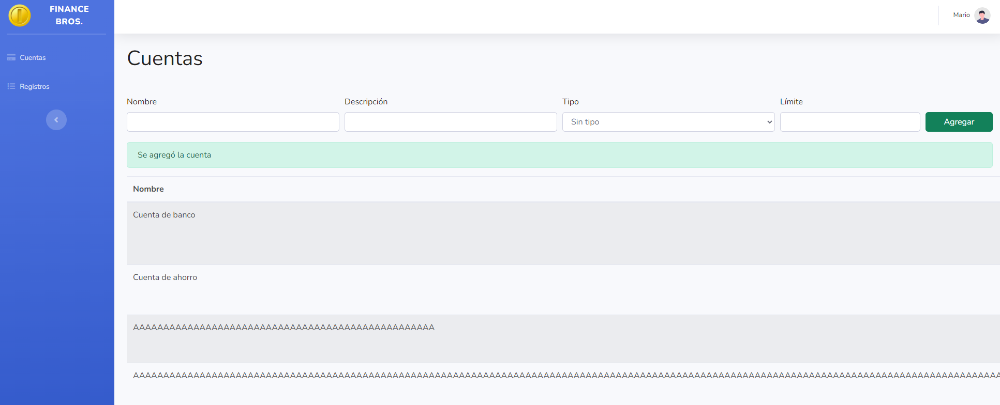

#### Bug2
**Resumen:** Al crear una cuenta con una letra en el Límite, cuyos valores deberían ser numéricos, se admite el 
valor con una letra en el medio 
**Estado:** Evaluando alcance  
**Plataforma:** Navegador Chrome 119.0.6045.159 (Official Build) (64-bit), Firefox 119.0.1  
**Descripción:** Creando una cuenta con alguna de las siguientes combinaciones probadas: 
- 111e1 (Falla)| Bug #6 | Al achicar la pantalla horizontalmente, el botón de "Agregar" queda cortado                                              | Baja      | Baja      | [Pasos a seguir](#Bug6) |
  - Descripción: 111e1
  - Tipo: Cualquier tipo disponible para seleccionar
  - Límite: 111e1

- **Datos 2do fallo**
  - Nombre: Cuenta: 111e111
  - Descripción: 111e111
  - Tipo: Cualquier tipo disponible para seleccionar
  - Límite: 111e111

- **Datos 3er fallo**
  - Nombre: Cuenta: 11111e1
  - Descripción: 11111e1
  - Tipo: Cualquier tipo disponible para seleccionar
  - Límite: 11111e1

**Severidad:** Media 
**Pasos a reproducir:**
- Pasos para el 1.er fallo
  - Colocar los datos de una cuenta con un valor de Límite con una letra en el medio "111e1"
  - Clickear en el botón "Agregar"
- Pasos para el 2.º fallo
  - Colocar los datos de una cuenta con un valor de Límite con una letra en el medio como "111e111"
  - Clickear en el botón "Agregar"
- Pasos para el 3.er fallo
  - Colocar los datos de una cuenta con un valor de Límite con una letra en el medio como "11111e1"
  - Clickear en el botón "Agregar"

**Resultado actual:** 
- En los tres fallos, el sistema permite crear la cuenta con el Límite con un valor numérico estándar.
- El valor del Límite en el primer fallo es: $1110.00
- El valor del Límite en el segundo fallo es: $1.11e+113
- El valor del Límite en el tercer fallo es: $111110.00  

**Resultado esperado:**  
- El sistema no permite crear la nueva cuenta por haber un carácter no numérico en el campo "Límite"  

**Adjuntos:**  
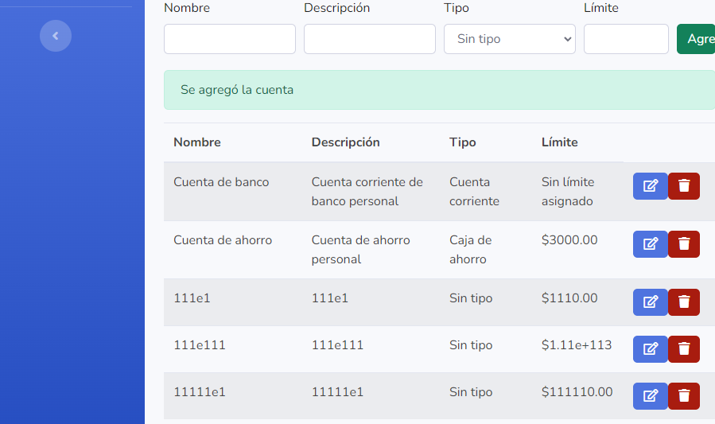

#### Bug3
**Resumen:** Se permite la edición de Límite por un valor negativo  
**Estado:** Evaluando alcance  
**Plataforma:** Navegador Chrome 119.0.6045.159 (Official Build) (64-bit), Firefox 119.0.1 
**Descripción:** Se permite la edición de Límite por un valor negativo, mostrando una alerta en verde que 
muestra em mensaje "Se modificó la cuenta" y el valor de Límite pasa a ser "Sin límite asignado"  
**Prioridad:** Alta  
**Datos de prueba:**
- Previo a editar:
  - Nombre: Cuenta de banco
  - Descripción: Cuenta corriente de banco personal
  - Tipo: Cuenta corriente
  - Límite: 1000
- Luego de editar:
  - Nombre: Cuenta de banco
  - Descripción: Cuenta corriente de banco personal
  - Tipo: Cuenta corriente
  - Límite: "Sin límite asignado"

**Severidad:** Alta  
**Pasos a reproducir:**
- Tener previamente una cuenta creada exitosamente
- Clickear en el botón de "Editar" en  una cuenta ya creada
- Luego intentar de poner un valor negativo en el Límite
- Clickear en el botón "Guardar"

**Resultado actual:**
- Se muestra una alerta en verde que indica que se modificó la cuenta exitosamente y el valor de Límite pasa a ser 
  "Sin límite asignado"

**Resultado esperado:**  
- Se muestra una alerta en rojo que indica que el Límite debe ser un valor no negativo  

**Adjuntos:**  
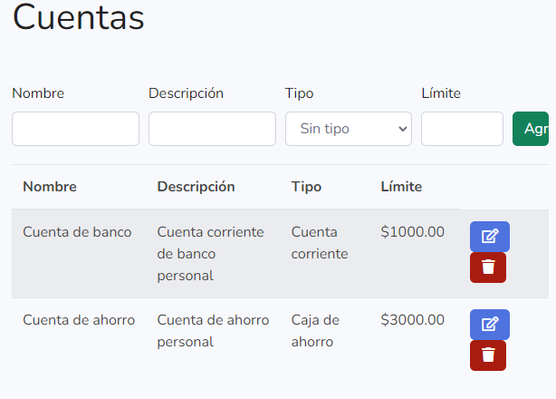
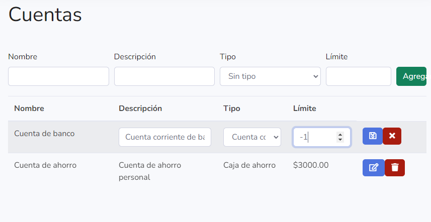
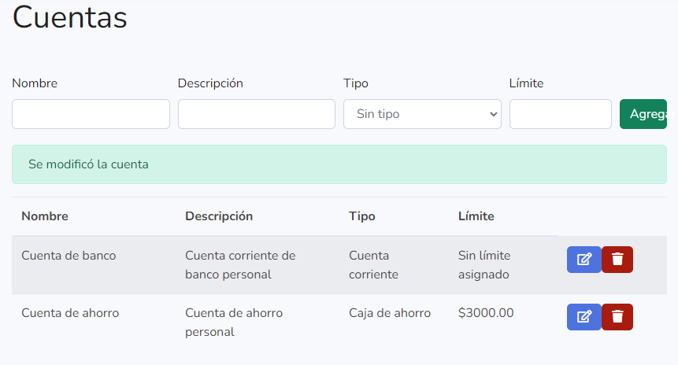

#### Bug4
**Resumen:** Se permite la edición de Límite por un valor con letras en el medio  
**Estado:** Evaluando alcance  
**Plataforma:**  Navegador Chrome 119.0.6045.159 (Official Build) (64-bit)  
**Descripción:**  Se permite la edición de Límite por un valor con letras en el medio, mostrando un número que 
no es el esperado.  
**Prioridad:** Alta  
**Datos de prueba:**
- Previo a editar:
  - Nombre: Cuenta de banco
  - Descripción: Cuenta corriente de banco personal
  - Tipo: Cuenta corriente
  - Límite: 1000
- Editar el valor de Límite por: 111e111

**Severidad:**  Alta  
**Pasos a reproducir:**
- Tener previamente una cuenta creada exitosamente con valores válidos
- Clickear en el botón de "Editar" en  una cuenta ya creada
- Luego intentar de poner un valor con letras en el medio en el Límite como por ejemplo: "111e111"
- Clickear en el botón "Guardar"
- Verificar el valor de Límite

**Resultado actual:**
- Se muestra una alerta en verde que indica que se modificó la cuenta exitosamente y el valor de Límite pasa a ser 
  "1.11e+113"

**Resultado esperado:**  
- Se muestra una alerta en rojo que indica que el Límite debe ser un valor numérico

**Adjuntos:**  
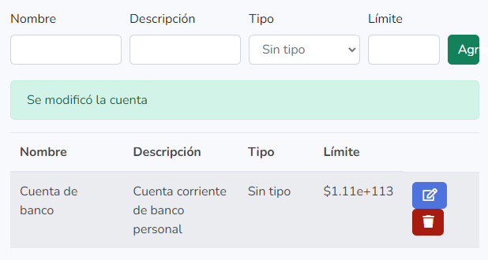

#### Bug5
**Resumen:**  Al clickear editar, no se puede cambiar de Registro Fijo a Fecha y viceversa  
**Estado:**  Evaluando alcance  
**Plataforma:**  Navegador Chrome 119.0.6045.159 (Official Build) (64-bit)  
**Descripción:**  Al clickear editar, no se puede cambiar de Registro Fijo a Fecha y viceversa, lo cual está 
especificado en el RF11  
**Prioridad:** Alta  
**Datos de prueba:** 
- Para pasar de gasto Fijo a Fecha:
  - Descripción: Zapatos
  - Monto: 500
  - Fijo: Si
  - Categoría: Gastos Comunes
  - Cuenta: Cuenta de banco
- Para pasar de gasto Fecha a Fijo:
  - Descripción: Gasto Fecha
  - Monto: 100
  - Fecha: 2021-10-10
  - Categoría: Gastos Comunes
  - Cuenta: Cuenta de banco

**Severidad:** Media  
**Pasos a reproducir:**
- Para pasar de registro Fijo a Fecha:
  - Tener previamente un registro creado exitosamente con valores válidos y Fijo en "Sí"
  - Clickear en el botón de "Editar" en  un registro ya creado
  - Corroborar que el campo de Fijo no se puede pasar a Fecha
- Para pasar de registro Fecha a Fijo:
  - Tener previamente un registro creado exitosamente con valores válidos y con una fecha válida
  - Clickear en el botón de "Editar" en  un registro ya creado
  - Corroborar que el campo de Fecha no se puede pasar a Fijo

**Resultado actual:** 
- Se permite editar todos los campos en un registro excepto pasarlo de registro de tipo Fijo a Fecha y viceversa

**Resultado esperado:** 
- Se permite editar todos los campos en un registro e inclusive cambiarlos de Fijo a Fecha y viceversa

**Adjuntos:** 
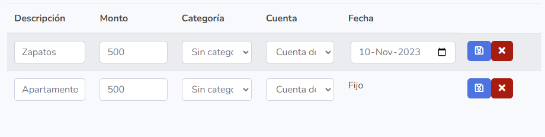

#### Bug6
**Resumen:** El botón "Agregar" puede quedar truncado 
**Estado:** Evaluando alcance  
**Plataforma:** Navegador Chrome 119.0.6045.159 (Official Build) (64-bit)  
**Descripción:** Al disminuir el tamaño horizontalmente en el navegador, el botón "Agregar" queda truncado
**Prioridad:** Baja  
**Datos de prueba:** N/A  

**Severidad:** Baja  
**Pasos a reproducir:**
- Abrir la aplicación en el navegador
- Disminuir el tamaño horizontalmente en el navegador
- Corroborar que el botón "Agregar" queda truncado en ciertos tamaños

**Resultado actual:** El botón "Agregar" queda truncado  
**Resultado esperado:** El botón "Agregar" no debería quedar truncado  
**Adjuntos:**  

#### Bug7
**Resumen:** Falta de scroll horizontal para las tablas de cuentas y registro  
**Estado:** Evaluando alcance  
**Plataforma:** Navegador Chrome 119.0.6045.159 (Official Build) (64-bit), Firefox 119.0.1  
**Descripción:** Cuando algún dato de la tabla contiene una palabra muy extensa, las tablas se ven cortadas, resultando que algunas columnas no sean accesibles.  
**Prioridad:** Media  
**Datos de prueba:** N/A 

**Severidad:** Media  
**Pasos a reproducir:**
- Abrir el navegador.
- Agregar una cuenta o registro con nombre y/o descripción que contenga una palabra extensa (mayor a 80 caracteres aprox.).
- Disminuir el tamaño horizontalmente en el navegador (Aproximadamente 1100 píxeles).
- Corroborar que no es posible acceder a las columnas ocultas.

**Resultado actual:** No es posible ver o acceder las columnas más a la derecha.  
**Resultado esperado:** Cuando la tabla no se está mostrando completamente, poder scrollear horizontalmente sobre la misma. 
**Adjuntos:**  
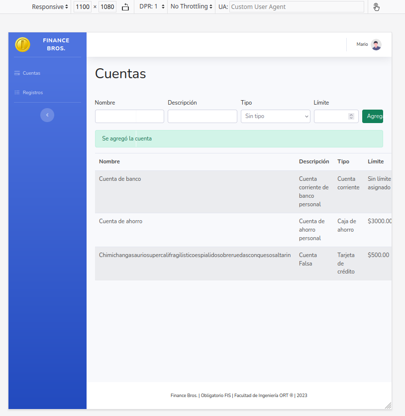
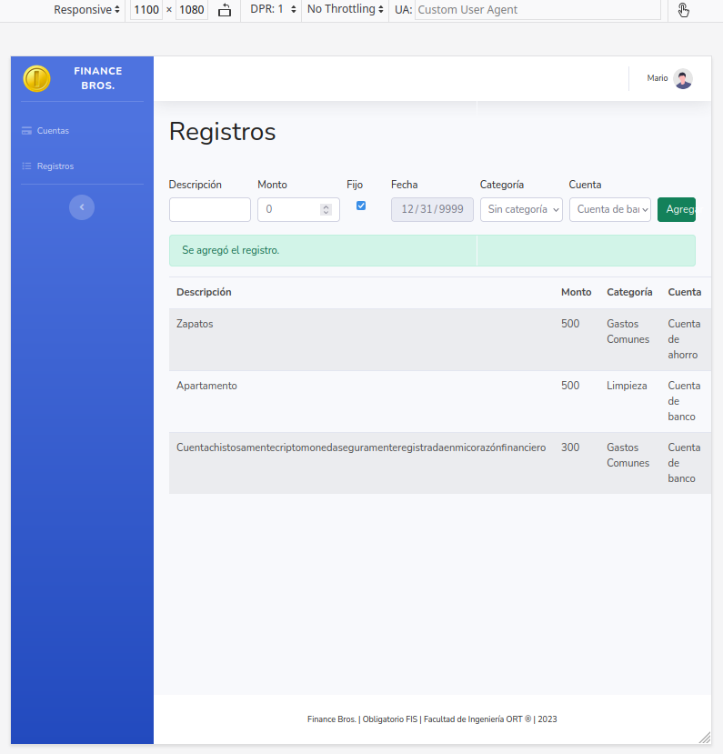
Notar que no es posible acceder a los botones de editar ni borrar.

#### Bug8
**Resumen:** Permite poner a editar varias filas de las cuentas pero solo guarda una. 
**Estado:**  
**Plataforma:** Navegador chrome y Firefox  
**Descripción:** Al clickear en el botón de editar, se puede poner a editar varias filas y cambiar los campos de las mismas, pero al dar click en guardar solo guardara la que clickes el botón de guardar.  
**Prioridad:** Media  
**Datos de prueba:**
Las cuentas que ya vienen por defecto o las que se crean.

**Severidad:** Baja  
**Pasos a reproducir:**
- Tener registros o cuentas creadas previamente.
- Dar click en los botones de editar de varias filas.
- Cambiar datos en los campos de las filas
- Dar click para guardar los cambios.

**Resultado actual:** Se permite editar todos los campos, pero guarda solo la fila en la que des click guardar.  
**Resultado esperado:** Al dar click en guardar, deberían guardarse todos los campos permitidos, o como curso alternativo solo permitir editar un registro.  
**Adjuntos:** 
Cuentas ya creadas: 
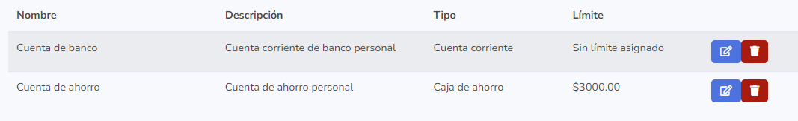 

Al dar click en editar en varios campos lo permite:
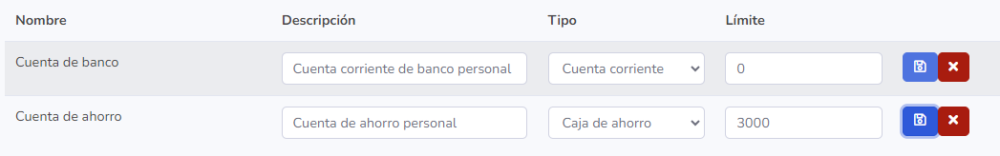
Se editan los campos:
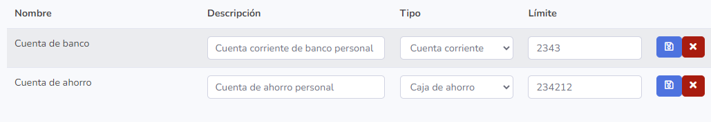
Al dar click en guardar en unas de las filas, se guardan los cambios solo en la fila elegida.
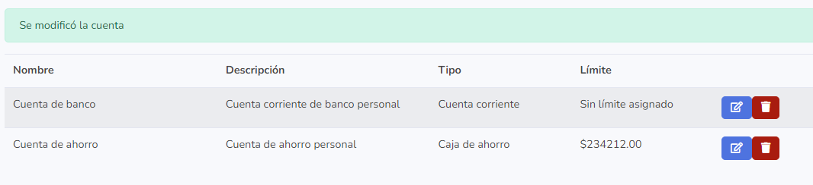
 

**Resultado actual:** No es posible ver o acceder las columnas más a la derecha.  
**Resultado esperado:** Cuando la tabla no se está mostrando completamente, poder scrollear horizontalmente sobre la misma. 
**Adjuntos:**  

Notar que no es posible acceder a los botones de editar ni borrar.

## Informe de calidad del sistema

### Numero de issues por tipo
  * Cantidad de bugs reportados en github: 7
  * Cantidad de features reportados en github: 1

### Evaluación global de calidad del sistema

La calidad general del sistema está en buenas condiciones, salvando algunos bugs que se encontraron en el testing y 
un par de features que se podrían agregar para mejorar la experiencia del usuario.  
La aplicación es intuitiva, todas las acciones disponibles estan a la vista, por lo que en principio podría ser una buena experiencia para el usuario.  
La interfaz cumple con el requerimiento de ser responsive, adaptandose a varios tamaños de pantalla, y tiene un buen diseño utilizando los estilos de Bootstrap.
Tambien se destaca el feedback que el usuario recibe al cuando realiza distintas acciones, como al crear, editar o borrar cuentas, y crear, editar y borrar registros.

## Reflexión

El testing es una parte fundamental del proceso de ingeniería de software. Es una parte fundamental que debe hacerse 
en varias etapas del desarrollo del software. La práctica de tomar un sistema ajeno y testearlo, nos permitió
posicionarnos mejor en el lugar de un tester y poder evaluar el sistema desde otro punto de vista.
Es una etapa, que como bien se mencionó en clase, debe hacerse de forma ordenada y siguiendo una metodología, se 
debe proveer de un detalle preciso al encontrar issues, de forma de que un desarrollador tenga el contexto completo 
del issue a resolver y como reproducirlo. De forma de lograr un debuggeado de la app más preciso, sabiendo que 
variables trackear y que pasos seguir para reproducir el error.

### Técnicas aplicadas y aprendizaje

Como se mencionó en el curso y también se dio un ejemplo de esto. Se empezó con el testing de caja negra. Se 
organizaron los CP realizando previamente las clases de equivalencia.
Las clases de equivalencia presentaron la dificultad de que en un inicio se pensaron en tipos de datos de entrada 
(String,numérico,fecha,etc..) para luego encontrarnos que funcionalmente algunos campos tenían diferencias mínimas, 
como por ejemplo un campo de entrada String puede ser vacío o no, puede tomar valores unicos o no, etc.
Optamos por hacer casos de prueba utilizando la técnica mostrada en clase de agrupar por clases de equivalencia, pero 
luego decidimos presentar nuevos casos de prueba los cuales nos ayudaron a encontrar nuevos errores en el sistema.
En un principio el testing fue realizado probando variaciones bastante rápido, lo cual nos llevó a tener que volver 
pasos atrás para encontrar la forma de reproducir errores. Algunos de estos errores luego fueron quitados de la 
lista de bugs, debido a que post discusión e investigación, se llegó a la conclusion de que no eran errores sino 
decisiones del desarrollo del sistema.